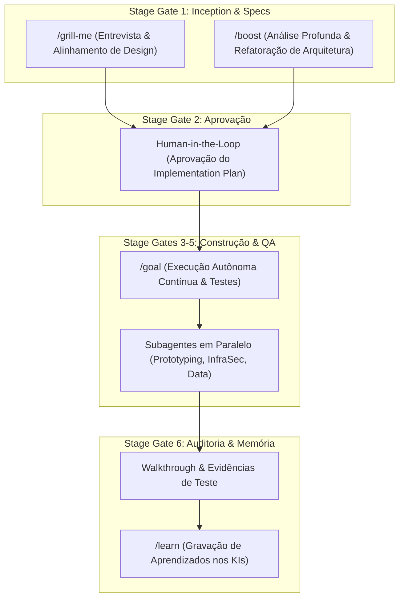

# Regra de Governança: Integração do Antigravity Harness às Squads do PCL AEOS

## Diretrizes Fundamentais

1. **PCL AEOS como Mestre de Governança**:
   - O ecossistema PCL AEOS é a fonte única de verdade para squads, especificações (`.specs/`), decisões arquiteturais (ADRs) e governança.
   - O Antigravity IDE atua como o **Harness de Execução Autônomo** que executa os papéis das Squads definidas no Paperclip.

2. **Substituição Conceitual de Squad**:
   - A squad responsável pela engenharia de código e prototipagem de soluções de software chama-se **`squad-prototyping`** (substituindo o antigo termo `squad-vibe-coding`).

3. **Uso de Comandos Slash e Stage Gates**:
   - **`/grill-me`**: Deve ser sugerido/utilizado no Stage Gate 1 (Inception e Especificação) sempre que houver necessidade de alinhar decisões de design com o Tech Lead.
   - **`/boost`**: Deve ser utilizado para refatorações profundas, análises de segurança ou resolução de problemas arquiteturais complexos.
   - **`/goal`**: Deve ser acionado para execução autônoma nos Stage Gates 3 a 5, onde a IA itera e corrige código até que todos os testes automatizados passem.
   - **`/learn`**: Deve ser acionado sempre que uma nova convenção ou correção relevante for established, gravando o aprendizado no repositório de Knowledge Items (KI) ou regras `.agents/rules/`.

4. **Trilha de Auditoria (ISO 42001 & ISO 27001)**:
   - Toda execução deve manter rastreabilidade total nos transcripts JSONL (`transcript_full.jsonl`).
   - Alterações de código não-triviais devem obrigatoriamente apresentar um `implementation_plan.md` (Stage Gate 1/2) para aprovação e um `walkthrough.md` (Stage Gate 6) com evidências de teste.
