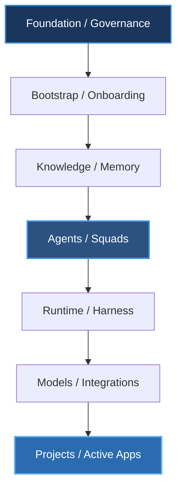
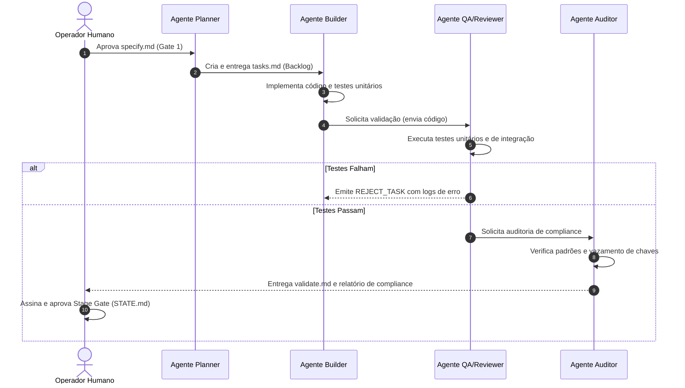
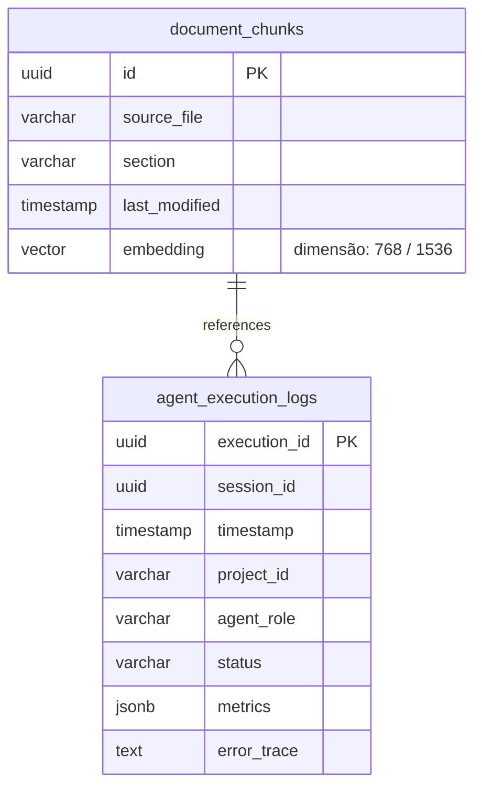

# PromptCoreLabs_AEOS (AI Engineering Operating System)

==================================================
APRESENTAÇÃO
==================================================

O **PromptCoreLabs_AEOS** é um Sistema Operacional de Engenharia Assistida por Inteligência Artificial (AI Engineering Operating System) concebido para governar, estruturar e gerenciar o desenvolvimento de software e a orquestração de squads de agentes inteligentes com total soberania de dados.

Este repositório consolidado serve como a **Única Fonte de Verdade (Single Source of Truth)** para a plataforma, organizando de forma rigorosa as regras de governança, o conhecimento, a memória persistente e os projetos de engenharia.

---

==================================================
MAPA DE ARQUITETURA LÓGICA (FLUXO DO CONHECIMENTO)
==================================================

O conhecimento no AEOS nasce nos fundamentos e diretrizes e é materializado através do Runtime no mundo externo:



---

==================================================
TAXONOMIA E ESTRUTURA DO REPOSITÓRIO
==================================================

| Diretório | Responsabilidade Arquitetural | Tipo |
|---|---|---|
| `foundation/` | Diretrizes fundamentais e constitucionais do ecossistema. | Core AEOS |
| `governance/` | Regras operacionais, papéis de tomada de decisão e Stage Gates. | Core AEOS |
| `bootstrap/` | Protocolos de onboarding e handoffs de sessões. | Core AEOS |
| `knowledge/` | Playbooks operacionais, padrões (TLC/ADR) e catálogos de ferramentas. | Core AEOS |
| `memory/` | RAG, PGVector local, índices e histórico de Execution Cells. | Core AEOS |
| `agents/` | Especificações e System Prompts dos agentes da squad de IA. | Core AEOS |
| `runtime/` | Infraestrutura local de contêineres e logs de execução. | Core AEOS |
| `templates/` | Scaffolding de documentos em branco (specify, design, adr). | Core AEOS |
| `integrations/` | Conexões com GitHub, Tailscale e Model Context Protocol (MCP). | Core AEOS |
| `projects/` | Projetos ativos em desenvolvimento assistido por IA. | Taxonomia |
| `tools/` | Utilitários locais e servidores MCP customizados. | Taxonomia |
| `external-references/` | Referências e links aos repositórios originais externos. | Taxonomia |
| `legacy/` | Histórico, diagramas e códigos antigos mantidos para referência. | Taxonomia |

---

==================================================
UML DE SEQUÊNCIA: FLUXO DE DESENVOLVIMENTO AGENTES
==================================================

O ciclo de vida das tarefas (TLC Spec-Driven v3) e a colaboração entre os agentes do PaperClip segue o protocolo de mensagens:



---

==================================================
MODELO DE DADOS DA MEMÓRIA VETORIAL (ERD)
==================================================

Estrutura relacional do PGVector no contêiner `pcl-db` para suporte ao RAG e ao histórico de contexto dos agentes:



---

==================================================
QUICKSTART: HARNESS LOCAL (DOCKER)
==================================================

O Harness local é gerido por meio do Docker Compose no root do projeto.

### Inicializar todos os serviços (PaperClip, OmniRoute, Postgres):
```bash
docker compose up -d
```

### Visualizar logs em tempo real:
```bash
docker compose logs -f
```

### Parar serviços preservando volumes persistentes:
```bash
docker compose down
```

---

==================================================
INTEGRAÇÃO DE MODELOS LLM
==================================================

*   **TIER-1 & TIER-2 (Cloud):** Roteados via OmniRoute (porta `20130`) aplicando o EBITDA Shield para conter gastos com APIs comerciais (Claude e Gemini).
*   **TIER-3 (Local - RTX GPU):**
    *   **LM Studio:** Executa o modelo `Qwen3-Coder-30B` na porta host `1234` (`http://host.docker.internal:1234` dentro dos contêineres).
    *   **Ollama:** Executa o modelo `Gemma 3 4B` na porta host `11434` (`http://host.docker.internal:11434`).

---
*PromptCoreLabs_AEOS v1.0 — Todos os direitos reservados – 2026*
