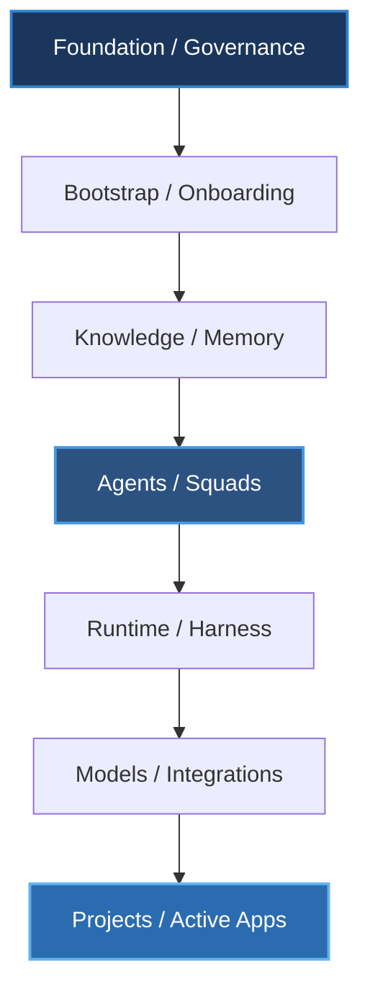
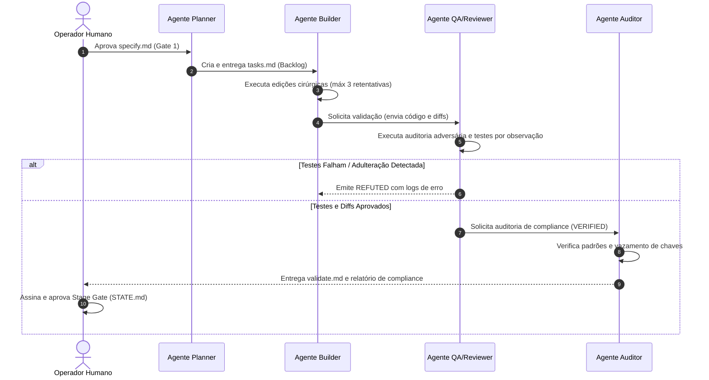
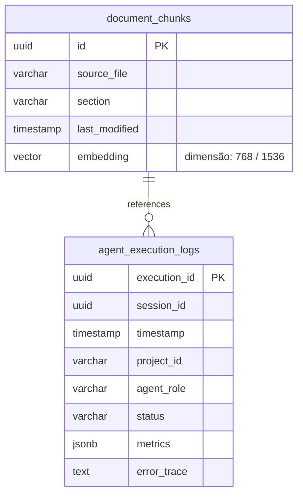

# PromptCoreLabs_AEOS (AI Engineering Operating System)

==================================================
🌟 DESTAQUE PRINCIPAL: LIVING ARCHITECTURE PCL AEOS
==================================================

Este portal é a **Única Fonte de Verdade (Single Source of Truth)** e a **Living Documentation (Documentação Viva e Dinâmica)** para o ecossistema **PromptCoreLabs_AEOS** (AI Engineering Operating System), conduzido pela inteligência arquitetural **Cortex**.

> 💡 **Dica de Navegação**: Clique sobre qualquer imagem miniatura ou título de card abaixo para **abrir uma nova aba no seu navegador** com a aplicação gráfica interativa do **Cortex Archify Engine** (com animações de sinal, alternância entre modo escuro/claro, filtros de visões e exportação em alta resolução).

---

## 📊 Galeria Visual de Diagramas Interativos (Cortex Archify Engine)

### 🔴 Diagramas Críticos (P0)

| Pré-Visualização (Thumbnail) | Diagrama & ID | Nível C4 / Dimensão | Aplicação Interativa (Nova Aba) |
|:---:|---|---|:---:|
| <a href="https://enterdufter.github.io/PromptCoreLabs_AEOS/projects/Living%20Architecture%20PCL%20AEOS/diagrams/interactive/c4-l1-context.html" target="_blank" rel="noopener noreferrer"></a> | **DIAG-C4-01**<br>System Context Diagram | C4 Level 1 (Context) | <a href="https://enterdufter.github.io/PromptCoreLabs_AEOS/projects/Living%20Architecture%20PCL%20AEOS/diagrams/interactive/c4-l1-context.html" target="_blank" rel="noopener noreferrer">🌐 **Abrir Diagrama Interativo**</a> |
| <a href="https://enterdufter.github.io/PromptCoreLabs_AEOS/projects/Living%20Architecture%20PCL%20AEOS/diagrams/interactive/c4-l2-containers.html" target="_blank" rel="noopener noreferrer"></a> | **DIAG-C4-02**<br>Harness Container Topology | C4 Level 2 (Containers) | <a href="https://enterdufter.github.io/PromptCoreLabs_AEOS/projects/Living%20Architecture%20PCL%20AEOS/diagrams/interactive/c4-l2-containers.html" target="_blank" rel="noopener noreferrer">🌐 **Abrir Diagrama Interativo**</a> |
| <a href="https://enterdufter.github.io/PromptCoreLabs_AEOS/projects/Living%20Architecture%20PCL%20AEOS/diagrams/interactive/c4-l3-components.html" target="_blank" rel="noopener noreferrer"></a> | **DIAG-C4-03**<br>Repository Component Breakdown | C4 Level 3 (Components) | <a href="https://enterdufter.github.io/PromptCoreLabs_AEOS/projects/Living%20Architecture%20PCL%20AEOS/diagrams/interactive/c4-l3-components.html" target="_blank" rel="noopener noreferrer">🌐 **Abrir Diagrama Interativo**</a> |
| <a href="https://enterdufter.github.io/PromptCoreLabs_AEOS/projects/Living%20Architecture%20PCL%20AEOS/diagrams/interactive/seq-tlc-execution.html" target="_blank" rel="noopener noreferrer"></a> | **DIAG-SEQ-01**<br>TLC Spec-Driven Execution Loop | Sequence / Workflow | <a href="https://enterdufter.github.io/PromptCoreLabs_AEOS/projects/Living%20Architecture%20PCL%20AEOS/diagrams/interactive/seq-tlc-execution.html" target="_blank" rel="noopener noreferrer">🌐 **Abrir Diagrama Interativo**</a> |

---

### 🟡 Diagramas de Alta Prioridade (P1)

| Pré-Visualização (Thumbnail) | Diagrama & ID | Nível C4 / Dimensão | Aplicação Interativa (Nova Aba) |
|:---:|---|---|:---:|
| <a href="https://enterdufter.github.io/PromptCoreLabs_AEOS/projects/Living%20Architecture%20PCL%20AEOS/diagrams/interactive/seq-omniroute-routing.html" target="_blank" rel="noopener noreferrer"></a> | **DIAG-SEQ-02**<br>OmniRoute LLM Request Lifecycle | Sequence Diagram | <a href="https://enterdufter.github.io/PromptCoreLabs_AEOS/projects/Living%20Architecture%20PCL%20AEOS/diagrams/interactive/seq-omniroute-routing.html" target="_blank" rel="noopener noreferrer">🌐 **Abrir Diagrama Interativo**</a> |
| <a href="https://enterdufter.github.io/PromptCoreLabs_AEOS/projects/Living%20Architecture%20PCL%20AEOS/diagrams/interactive/data-rag-memory.html" target="_blank" rel="noopener noreferrer"></a> | **DIAG-DAT-01**<br>RAG & Memory Data Lineage | Dataflow Diagram | <a href="https://enterdufter.github.io/PromptCoreLabs_AEOS/projects/Living%20Architecture%20PCL%20AEOS/diagrams/interactive/data-rag-memory.html" target="_blank" rel="noopener noreferrer">🌐 **Abrir Diagrama Interativo**</a> |
| <a href="https://enterdufter.github.io/PromptCoreLabs_AEOS/projects/Living%20Architecture%20PCL%20AEOS/diagrams/interactive/life-cortex-micro-loop.html" target="_blank" rel="noopener noreferrer"></a> | **DIAG-LIF-01**<br>PCL Cortex Micro-Loop Lifecycle | State Machine / Lifecycle | <a href="https://enterdufter.github.io/PromptCoreLabs_AEOS/projects/Living%20Architecture%20PCL%20AEOS/diagrams/interactive/life-cortex-micro-loop.html" target="_blank" rel="noopener noreferrer">🌐 **Abrir Diagrama Interativo**</a> |
| <a href="https://enterdufter.github.io/PromptCoreLabs_AEOS/projects/Living%20Architecture%20PCL%20AEOS/diagrams/interactive/infra-network-security.html" target="_blank" rel="noopener noreferrer"></a> | **DIAG-INF-01**<br>Network & Security Topology | Infrastructure | <a href="https://enterdufter.github.io/PromptCoreLabs_AEOS/projects/Living%20Architecture%20PCL%20AEOS/diagrams/interactive/infra-network-security.html" target="_blank" rel="noopener noreferrer">🌐 **Abrir Diagrama Interativo**</a> |
| <a href="https://enterdufter.github.io/PromptCoreLabs_AEOS/projects/Living%20Architecture%20PCL%20AEOS/diagrams/interactive/agents-squad-map.html" target="_blank" rel="noopener noreferrer"></a> | **DIAG-AGT-01**<br>Squad Orchestration & Roles | Component / Workflow | <a href="https://enterdufter.github.io/PromptCoreLabs_AEOS/projects/Living%20Architecture%20PCL%20AEOS/diagrams/interactive/agents-squad-map.html" target="_blank" rel="noopener noreferrer">🌐 **Abrir Diagrama Interativo**</a> |

---

### 🔵 Diagramas de Subsistemas & Operação (P2)

| Pré-Visualização (Thumbnail) | Diagrama & ID | Nível C4 / Dimensão | Aplicação Interativa (Nova Aba) |
|:---:|---|---|:---:|
| <a href="https://enterdufter.github.io/PromptCoreLabs_AEOS/projects/Living%20Architecture%20PCL%20AEOS/diagrams/interactive/mcp-interconnection.html" target="_blank" rel="noopener noreferrer"></a> | **DIAG-MCP-01**<br>MCP Server Interconnection Map | Component / Dataflow | <a href="https://enterdufter.github.io/PromptCoreLabs_AEOS/projects/Living%20Architecture%20PCL%20AEOS/diagrams/interactive/mcp-interconnection.html" target="_blank" rel="noopener noreferrer">🌐 **Abrir Diagrama Interativo**</a> |
| <a href="https://enterdufter.github.io/PromptCoreLabs_AEOS/projects/Living%20Architecture%20PCL%20AEOS/diagrams/interactive/workflow-bootstrap-onboarding.html" target="_blank" rel="noopener noreferrer"></a> | **DIAG-BS-01**<br>Bootstrap & Onboarding Pipeline | Workflow Diagram | <a href="https://enterdufter.github.io/PromptCoreLabs_AEOS/projects/Living%20Architecture%20PCL%20AEOS/diagrams/interactive/workflow-bootstrap-onboarding.html" target="_blank" rel="noopener noreferrer">🌐 **Abrir Diagrama Interativo**</a> |
| <a href="https://enterdufter.github.io/PromptCoreLabs_AEOS/projects/Living%20Architecture%20PCL%20AEOS/diagrams/interactive/gov-stage-gates-matrix.html" target="_blank" rel="noopener noreferrer"></a> | **DIAG-GOV-01**<br>Governance & Stage Gates Matrix | Workflow Diagram | <a href="https://enterdufter.github.io/PromptCoreLabs_AEOS/projects/Living%20Architecture%20PCL%20AEOS/diagrams/interactive/gov-stage-gates-matrix.html" target="_blank" rel="noopener noreferrer">🌐 **Abrir Diagrama Interativo**</a> |
| <a href="https://enterdufter.github.io/PromptCoreLabs_AEOS/projects/Living%20Architecture%20PCL%20AEOS/diagrams/interactive/seq-devex-loop.html" target="_blank" rel="noopener noreferrer"></a> | **DIAG-DEV-01**<br>Developer Experience & IDE Loop | Sequence Diagram | <a href="https://enterdufter.github.io/PromptCoreLabs_AEOS/projects/Living%20Architecture%20PCL%20AEOS/diagrams/interactive/seq-devex-loop.html" target="_blank" rel="noopener noreferrer">🌐 **Abrir Diagrama Interativo**</a> |
| <a href="https://enterdufter.github.io/PromptCoreLabs_AEOS/projects/Living%20Architecture%20PCL%20AEOS/diagrams/interactive/data-legacy-migration.html" target="_blank" rel="noopener noreferrer"></a> | **DIAG-LEG-01**<br>Legacy Migration Dataflow | Dataflow Diagram | <a href="https://enterdufter.github.io/PromptCoreLabs_AEOS/projects/Living%20Architecture%20PCL%20AEOS/diagrams/interactive/data-legacy-migration.html" target="_blank" rel="noopener noreferrer">🌐 **Abrir Diagrama Interativo**</a> |

---

### 💜 Diagramas Evolutivos & Deep-Dive (P3)

| Pré-Visualização (Thumbnail) | Diagrama & ID | Nível C4 / Dimensão | Aplicação Interativa (Nova Aba) |
|:---:|---|---|:---:|
| <a href="https://enterdufter.github.io/PromptCoreLabs_AEOS/projects/Living%20Architecture%20PCL%20AEOS/diagrams/interactive/c4-l3-projects-taxonomy.html" target="_blank" rel="noopener noreferrer"></a> | **DIAG-PRJ-01**<br>Projects Taxonomy & Isolation | Component Diagram | <a href="https://enterdufter.github.io/PromptCoreLabs_AEOS/projects/Living%20Architecture%20PCL%20AEOS/diagrams/interactive/c4-l3-projects-taxonomy.html" target="_blank" rel="noopener noreferrer">🌐 **Abrir Diagrama Interativo**</a> |
| <a href="https://enterdufter.github.io/PromptCoreLabs_AEOS/projects/Living%20Architecture%20PCL%20AEOS/diagrams/interactive/sec-zero-trust-flow.html" target="_blank" rel="noopener noreferrer"></a> | **DIAG-SEC-01**<br>Secret Management & Zero Trust | Infrastructure / Security | <a href="https://enterdufter.github.io/PromptCoreLabs_AEOS/projects/Living%20Architecture%20PCL%20AEOS/diagrams/interactive/sec-zero-trust-flow.html" target="_blank" rel="noopener noreferrer">🌐 **Abrir Diagrama Interativo**</a> |
| <a href="https://enterdufter.github.io/PromptCoreLabs_AEOS/projects/Living%20Architecture%20PCL%20AEOS/diagrams/interactive/obs-audit-trail.html" target="_blank" rel="noopener noreferrer"></a> | **DIAG-OBS-01**<br>Observability & Audit Trail | Dataflow / Lifecycle | <a href="https://enterdufter.github.io/PromptCoreLabs_AEOS/projects/Living%20Architecture%20PCL%20AEOS/diagrams/interactive/obs-audit-trail.html" target="_blank" rel="noopener noreferrer">🌐 **Abrir Diagrama Interativo**</a> |
| <a href="https://enterdufter.github.io/PromptCoreLabs_AEOS/projects/Living%20Architecture%20PCL%20AEOS/diagrams/interactive/c4-l4-cortex-engine.html" target="_blank" rel="noopener noreferrer"></a> | **DIAG-C4-04**<br>Code-Level Class & Interface Specs | C4 Level 4 (Code) | <a href="https://enterdufter.github.io/PromptCoreLabs_AEOS/projects/Living%20Architecture%20PCL%20AEOS/diagrams/interactive/c4-l4-cortex-engine.html" target="_blank" rel="noopener noreferrer">🌐 **Abrir Diagrama Interativo**</a> |

---

## 📚 ÍNDICE DE MÓDULOS & DRILL-DOWN PARA O REPOSITÓRIO

### 🏛️ Módulos de Documentação de Domínio (`projects/Living Architecture PCL AEOS/docs/`)
- 🎯 **[Estratégia & Visão](projects/Living%20Architecture%20PCL%20AEOS/docs/strategy/README.md)** — Visão corporativa, OKRs e North Star Metric.
- 📐 **[Modelo C4 & Diagramas](projects/Living%20Architecture%20PCL%20AEOS/docs/c4-model/README.md)** — Navegação C4 (L1 Contexto, L2 Contêineres, L3 Componentes, L4 Código).
- 🤖 **[Agents & Squads](projects/Living%20Architecture%20PCL%20AEOS/docs/agents-squads/README.md)** — Especificação detalhada dos 15 Agentes e matriz RACI.
- 🧠 **[Memory & RAG Vetorial](projects/Living%20Architecture%20PCL%20AEOS/docs/memory-rag/README.md)** — Pipeline RAG, embeddings 768D e PGVector no PostgreSQL 17.
- 🐳 **[Infraestrutura & Docker Harness](projects/Living%20Architecture%20PCL%20AEOS/docs/infrastructure/README.md)** — Contêineres Docker, GPUs locais e Tailscale.
- ⚡ **[Runtime & AI Gateway OmniRoute](projects/Living%20Architecture%20PCL%20AEOS/docs/runtime/README.md)** — Roteamento de inferência e EBITDA Shield.
- 🛡️ **[Governança TLC Spec-Driven v3](projects/Living%20Architecture%20PCL%20AEOS/docs/governance/README.md)** — Matriz dos 5 Stage Gates sequenciais.
- 🔌 **[Integrações & Protocolo MCP](projects/Living%20Architecture%20PCL%20AEOS/docs/integrations-mcp/README.md)** — Servidores MCP (`pcl-cortex`, `gemini-notebooklm`).
- 🔒 **[Segurança & Compliance Zero Trust](projects/Living%20Architecture%20PCL%20AEOS/docs/security-compliance/README.md)** — Diretriz Zero Secret Leak e varredura CISO.
- 📜 **[ADRs & Decisões Arquiteturais](projects/Living%20Architecture%20PCL%20AEOS/docs/adrs/README.md)** — Registros imutáveis de decisões (ADR-0001 a ADR-0007).
- 📖 **[Glossário & Taxonomia Oficial](projects/Living%20Architecture%20PCL%20AEOS/docs/glossary/README.md)** — Dicionário completo de termos da plataforma.

### 📜 Suíte de Governança do Projeto (`.specs/`)
- 📄 **[specify.md](projects/Living%20Architecture%20PCL%20AEOS/.specs/specify.md)** — Requisitos Funcionais (FR) e Não Funcionais (NFR).
- 📄 **[design.md](projects/Living%20Architecture%20PCL%20AEOS/.specs/design.md)** — Arquitetura de visualização e Matriz de Rastreabilidade.
- 📄 **[tasks.md](projects/Living%20Architecture%20PCL%20AEOS/.specs/tasks.md)** — Backlog atômico de tarefas concluídas (15/15).
- 📄 **[validate.md](projects/Living%20Architecture%20PCL%20AEOS/.specs/validate.md)** — Relatório de conformidade QA e parecer de auditoria.

---

==================================================
DOCUMENTAÇÃO E ESTRUTURA HISTÓRICA DO REPOSITÓRIO
==================================================

### APRESENTAÇÃO

O **PromptCoreLabs_AEOS** é um Sistema Operacional de Engenharia Assistida por Inteligência Artificial (AI Engineering Operating System) concebido para governar, estruturar e gerenciar o desenvolvimento de software e a orquestração de squads de agentes inteligentes com total soberania de dados.

Este repositório consolidado serve como a **Única Fonte de Verdade (Single Source of Truth)** para a plataforma, organizando de forma rigorosa as regras de governança, o conhecimento, a memória persistente e os projetos de engenharia.

Para uma visão aprofundada da arquitetura do sistema e da topologia de contêineres do Harness físico, consulte os diagramas da [Arquitetura Corporativa C4 Model](architecture/c4-model.md).

---

### MAPA DE ARQUITETURA LÓGICA (FLUXO DO CONHECIMENTO)

O conhecimento no AEOS nasce nos fundamentos e diretrizes e é materializado através do Runtime no mundo externo:



---

### TAXONOMIA E ESTRUTURA DO REPOSITÓRIO

| Diretório | Responsabilidade Arquitetural | Tipo |
|---|---|---|
| `foundation/` | Diretrizes fundamentais e constitucionais do ecossistema. | Core AEOS |
| `governance/` | Regras operacionais, papéis de tomada de decisão e Stage Gates. | Core AEOS |
| `bootstrap/` | Protocolos de onboarding e handoffs de sessões. | Core AEOS |
| `knowledge/` | Playbooks operacionais, padrões (PCL Cortex/TLC/ADR) e catálogos. | Core AEOS |
| `memory/` | RAG, PGVector local, índices e histórico de Execution Cells. | Core AEOS |
| `agents/` | Especificações e System Prompts dos agentes da squad de IA. | Core AEOS |
| `runtime/` | Infraestrutura local de contêineres e logs de execução. | Core AEOS |
| `templates/` | Scaffolding de documentos em branco (specify, design, adr). | Core AEOS |
| `integrations/` | Conexões com GitHub, Tailscale e Model Context Protocol (MCP). | Core AEOS |
| `mcp/` | Servidores MCP locais do repositório (`pcl-cortex`) e manifesto `mcp.config.json`. | Core AEOS |
| `projects/` | Projetos ativos em desenvolvimento assistido por IA. | Taxonomia |
| `tools/` | Utilitários locais e servidores MCP customizados. | Taxonomia |
| `external-references/` | Referências e links aos repositórios originais externos. | Taxonomia |
| `legacy/` | Histórico, diagramas e códigos antigos mantidos para referência. | Taxonomia |

---

### UML DE SEQUÊNCIA: FLUXO DE DESENVOLVIMENTO AGENTES

O ciclo de vida das tarefas (TLC Spec-Driven v3 e PCL Cortex Micro-Loop) e a colaboração entre os agentes do PaperClip segue o protocolo de mensagens:



---

### MODELO DE DADOS DA MEMÓRIA VETORIAL (ERD)

Estrutura relacional do PGVector no contêiner `pcl-db` para suporte ao RAG e ao histórico de contexto dos agentes:



---

### QUICKSTART: HARNESS LOCAL (DOCKER)

O Harness local é gerido por meio do Docker Compose no root do projeto.

#### Inicializar todos os serviços (PaperClip, OmniRoute, Postgres):
```bash
docker compose up -d
```

#### Visualizar logs em tempo real:
```bash
docker compose logs -f
```

#### Parar serviços preservando volumes persistentes:
```bash
docker compose down
```

---

### INTEGRAÇÃO DE MODELOS LLM & PCL CORTEX MICRO-LOOP

*   **TIER-1 (High Logic - Cloud):** Roteado via OmniRoute (porta `20130`) aplicando o EBITDA Shield para análises de arquitetura e especificações (`specify.md`) utilizando Claude 3.5 Sonnet e Gemini 3.1 Pro.
*   **TIER-2 (Fast Execution - Cloud):** Roteado para escrita rápida de código pelo Builder (Gemini 3 Flash / GPT-4o-mini).
*   **TIER-3 (Local Zero Cost / Cloud Fast Fallback):** Roteado para triagem de tarefas triviais (Trivial Gate), coleta de evidências e auditoria adversária do agente QA.
    *   **LM Studio / Ollama:** Quando ativos na GPU local, executam `Qwen3-Coder-30B` e `Gemma 3 4B`.
    *   **Cloud Fast Fallback:** Quando os modelos locais estiverem inativos, redireciona automaticamente para Gemini 3 Flash / GPT-4o-mini, garantindo altíssima velocidade e baixo consumo de tokens.

Para mais detalhes da disciplina de micro-execução dos agentes, consulte [knowledge/patterns/pcl-cortex-micro-loop.md](knowledge/patterns/pcl-cortex-micro-loop.md).

---
*PromptCoreLabs_AEOS v1.0 — Todos os direitos reservados – 2026*
