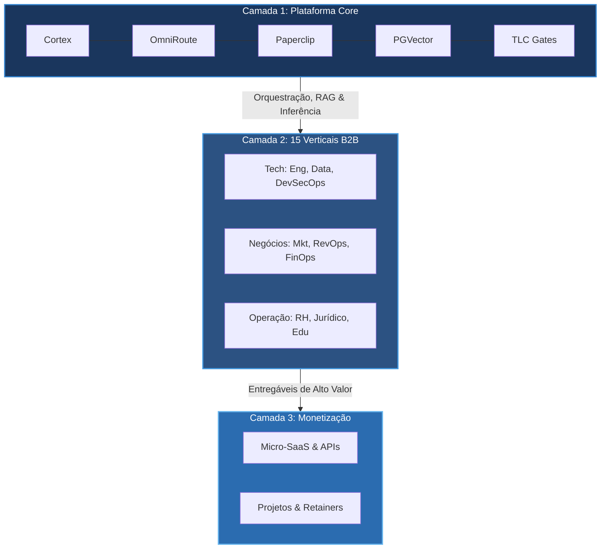
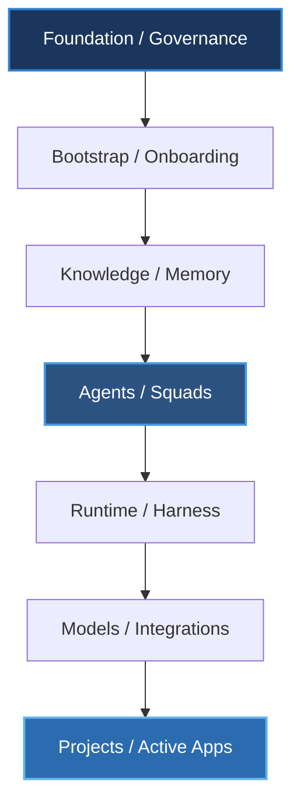
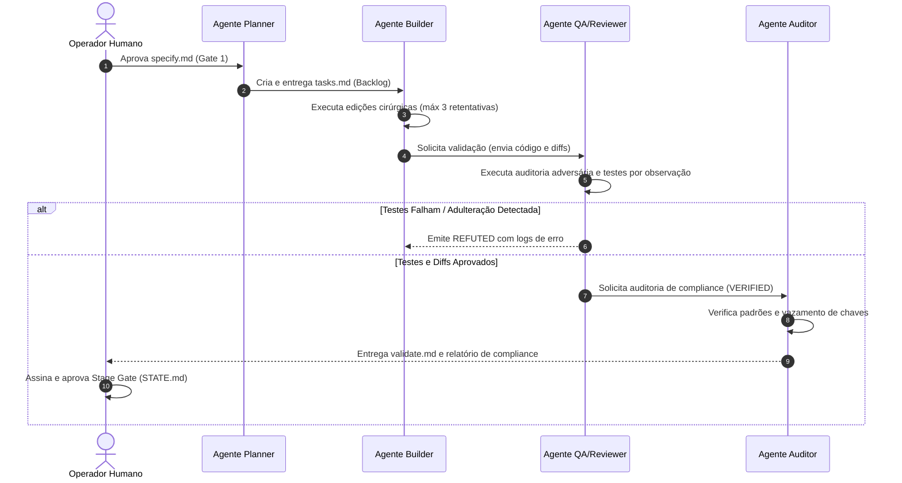
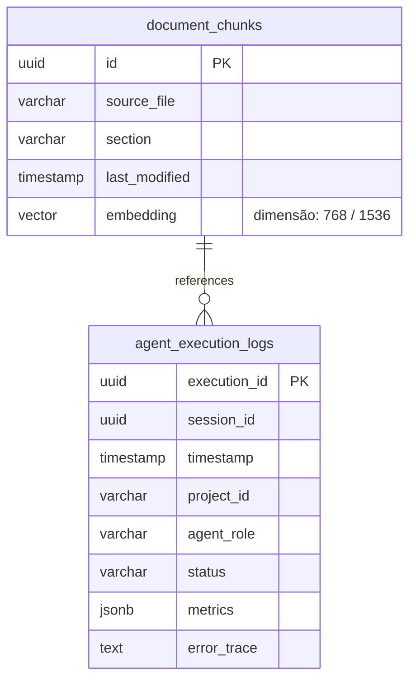
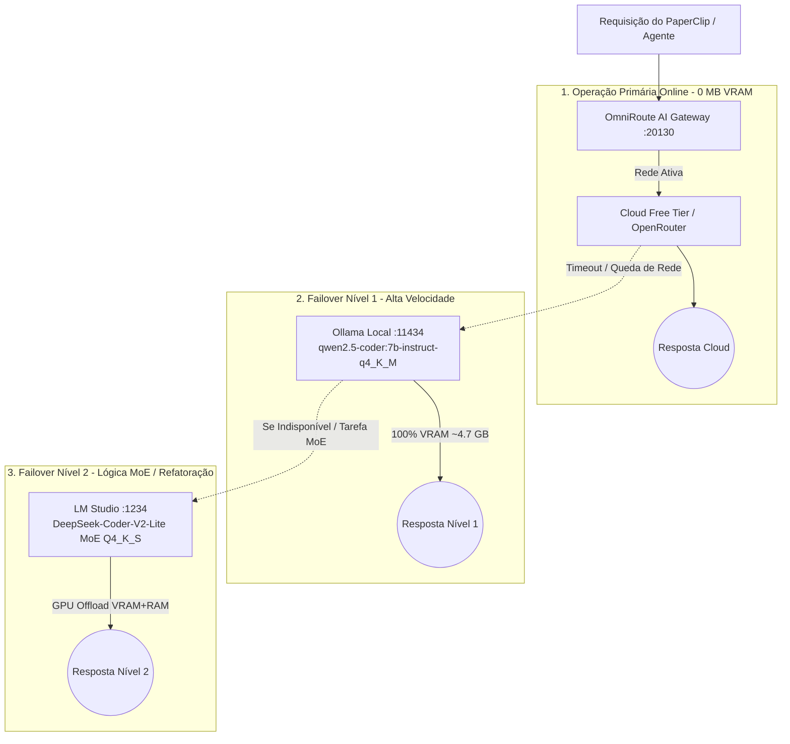
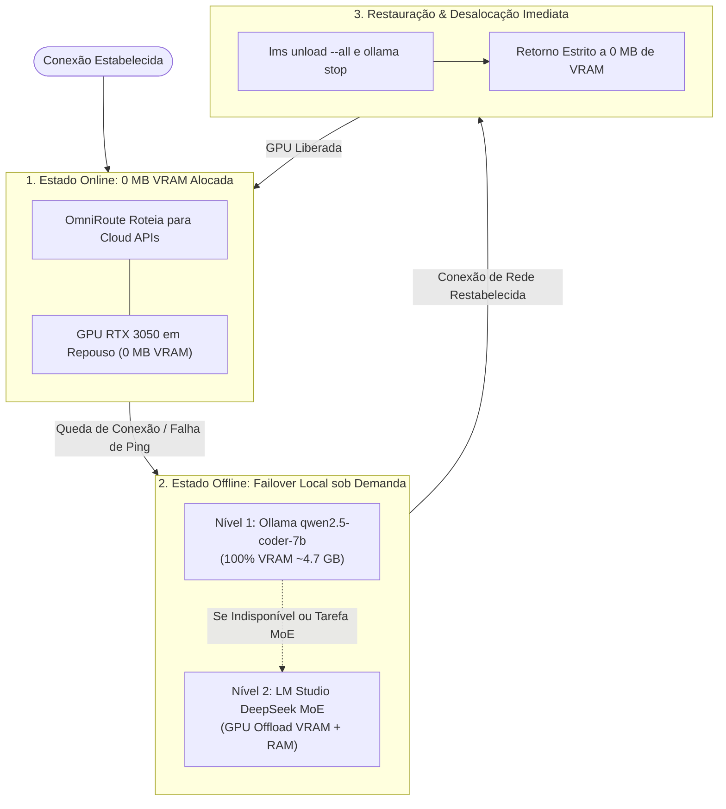

# PromptCoreLabs_AEOS (AI Engineering Operating System)

==================================================
🌟 TRILHO DE APRENDIZADO ARQUITETURAL & LIVING ARCHITECTURE
==================================================

Este portal é a **Única Fonte de Verdade (Single Source of Truth)** e a **Living Documentation (Documentação Viva e Dinâmica)** para o ecossistema **PromptCoreLabs_AEOS** (AI Engineering Operating System), conduzido pela inteligência arquitetural **Cortex**.

> 💡 **Guia Narrativo**: Para navegar intuitivamente pela plataforma, siga os **6 Passos Sequenciais** abaixo. Clique sobre qualquer card visual para **abrir uma nova aba no seu navegador** com a aplicação gráfica interativa do **PCL Cortex Engine**.

---

## 🏢 PCL-AEOS v2.0: Holding Digital (AI-as-a-Service)

A nossa arquitetura operacional evoluiu para um modelo de **Holding Digital (3 Camadas)**, operando com **15 Verticais de Negócio B2B (Profit Centers)** apoiados em infraestrutura de **custo marginal zero ($0 marginal cost)**.



| Previsualização (Interativa) | Diagrama & Detalhes | Ações & Documentação |
|:---:|---|:---:|
| <a href="https://enterdufter.github.io/PromptCoreLabs_AEOS/projects/Living%20Architecture%20PCL%20AEOS/diagrams/interactive/pcl-aeos-v2-holding.html" target="_blank" rel="noopener noreferrer"></a> | **DIAG-HOLD-01 • Holding Digital (3 Camadas)**<br>Representação topológica oficial gerada pelo *Cortex Engine*, mapeando a Plataforma Core (Cortex, OmniRoute, Paperclip), os 15 clusters B2B e a saída de monetização. | <a href="https://enterdufter.github.io/PromptCoreLabs_AEOS/projects/Living%20Architecture%20PCL%20AEOS/diagrams/interactive/pcl-aeos-v2-holding.html" target="_blank" rel="noopener noreferrer">🌐 **Abrir Interativo (Nova Aba)**</a><br><br>[📖 Operating Model](ADR-005) |

---

## 🧭 Trilho de Aprendizado Arquitetural em 6 Fases

1. **[Passo 1: Visão Macro & Fundação](#passo-1-visão-macro--fundação-do-sistema)** — Conceito geral, Fronteiras C4 L1 e Contêineres Docker C4 L2.
2. **[Passo 2: Squad de IA & Agentes](#passo-2-squad-de-ia--agentes-inteligentes)** — Manual dos 15 Agentes, Micro-Loop Cortex e Sequência DevEx.
3. **[Passo 3: Conhecimento & RAG Vetorial](#passo-3-conhecimento--memória-persistente-rag)** — Ingestão RAG, Embeddings 768D e ERD PGVector.
4. **[Passo 4: Backup & DRP](#passo-4-backup--drp-disaster-recovery-plan)** — Backup Cifrado AES-256 no R2, Borda D1/Vectorize e DRP Engine.
5. **[Passo 5: Infra, Runtime & Governança](#passo-5-infraestrutura-runtime--governança)** — AI Gateway OmniRoute, Tailscale e os 5 Stage Gates TLC v3.
6. **[Passo 6: Execução Reativa & Failover Sob Demanda](#passo-6-execução-reativa--failover-sob-demanda-pcl-aeos-pilha-local)** — Inferência Reativa, Trigger-Based Watchers e Matriz de Portabilidade.

---

### PASSO 1: VISÃO MACRO & FUNDAÇÃO DO SISTEMA

> **O que você vai aprender aqui:** O *PromptCoreLabs_AEOS* é um sistema operacional soberano concebido para governar o desenvolvimento assistido por IA. Nesta primeira fase, você entenderá o contexto do sistema (atores e fronteira local/nuvem) e a topologia de contêineres do Harness físico.

#### Fluxo do Conhecimento no AEOS



#### Diagramas Fundacionais (Níveis C4 L1 e L2)

| Previsualização (Thumbnail PNG) | Diagrama & Detalhes | Ações & Documentação |
|:---:|---|:---:|
| <a href="https://enterdufter.github.io/PromptCoreLabs_AEOS/projects/Living%20Architecture%20PCL%20AEOS/diagrams/interactive/c4-l1-context.html" target="_blank" rel="noopener noreferrer"></a> | **DIAG-C4-01 • System Context Diagram**<br>Mapeia o operador humano, a fronteira local protegida por VPN Mesh Tailscale, as conexões de inferência na nuvem e o repositório remoto GitHub. | <a href="https://enterdufter.github.io/PromptCoreLabs_AEOS/projects/Living%20Architecture%20PCL%20AEOS/diagrams/interactive/c4-l1-context.html" target="_blank" rel="noopener noreferrer">🌐 **Abrir Interativo (Nova Aba)**</a><br><br>[📖 Artigo de Estratégia](projects/Living%20Architecture%20PCL%20AEOS/docs/strategy/README.md) |
| <a href="https://enterdufter.github.io/PromptCoreLabs_AEOS/projects/Living%20Architecture%20PCL%20AEOS/diagrams/interactive/c4-l2-containers.html" target="_blank" rel="noopener noreferrer"></a> | **DIAG-C4-02 • Harness Container Topology**<br>Detalha os 3 contêineres Docker principais: `pcl-db` (PostgreSQL + PGVector), `pcl-omniroute` (Proxy de Inferência) e `pcl-paperclip` (Dashboard de Orquestração). | <a href="https://enterdufter.github.io/PromptCoreLabs_AEOS/projects/Living%20Architecture%20PCL%20AEOS/diagrams/interactive/c4-l2-containers.html" target="_blank" rel="noopener noreferrer">🌐 **Abrir Interativo (Nova Aba)**</a><br><br>[📖 Artigo de Runtime & Contêineres](projects/Living%20Architecture%20PCL%20AEOS/docs/runtime/README.md) |
| <a href="https://enterdufter.github.io/PromptCoreLabs_AEOS/projects/Living%20Architecture%20PCL%20AEOS/diagrams/interactive/c4-l3-components.html" target="_blank" rel="noopener noreferrer"></a> | **DIAG-C4-03 • Repository Component Breakdown**<br>Exibe a decomposição dos 14 diretórios chave do repositório consolidado e o fluxo de dados entre governança, memória e execução. | <a href="https://enterdufter.github.io/PromptCoreLabs_AEOS/projects/Living%20Architecture%20PCL%20AEOS/diagrams/interactive/c4-l3-components.html" target="_blank" rel="noopener noreferrer">🌐 **Abrir Interativo (Nova Aba)**</a><br><br>[📖 Artigo do Modelo C4](projects/Living%20Architecture%20PCL%20AEOS/docs/c4-model/README.md) |
| <a href="https://enterdufter.github.io/PromptCoreLabs_AEOS/projects/Living%20Architecture%20PCL%20AEOS/diagrams/interactive/c4-l3-projects-taxonomy.html" target="_blank" rel="noopener noreferrer"></a> | **DIAG-PRJ-01 • Projects Taxonomy & Isolation**<br>Demonstra as regras de isolamento soberano dos projetos contidos no diretório `projects/` (como a Living Architecture e o Crialli). | <a href="https://enterdufter.github.io/PromptCoreLabs_AEOS/projects/Living%20Architecture%20PCL%20AEOS/diagrams/interactive/c4-l3-projects-taxonomy.html" target="_blank" rel="noopener noreferrer">🌐 **Abrir Interativo (Nova Aba)**</a><br><br>[📖 Glossário Oficial](projects/Living%20Architecture%20PCL%20AEOS/docs/glossary/README.md) |

---

### PASSO 2: SQUAD DE IA & AGENTES INTELIGENTES

> **O que você vai aprender aqui:** O ecossistema PCL AEOS orquestra uma squad com **15 Agentes Inteligentes especialistas**. Nesta etapa, você verá como o Planner, Builder, QA e Auditor colaboram no protocolo de mensagens e na governança do PaperClip.

#### UML de Sequência: Colaboração Atômica entre Agentes



#### Diagramas da Squad e Ciclo de Vida dos Agentes

| Previsualização (Thumbnail PNG) | Diagrama & Detalhes | Ações & Documentação |
|:---:|---|:---:|
| <a href="https://enterdufter.github.io/PromptCoreLabs_AEOS/projects/Living%20Architecture%20PCL%20AEOS/diagrams/interactive/agents-squad-map.html" target="_blank" rel="noopener noreferrer"></a> | **DIAG-AGT-01 • Squad Orchestration & Roles**<br>Mapeia os 15 agentes organizados nas 4 camadas: Estratégia/Negócios, Engenharia/Especificação, Execução de Código e Qualidade/Segurança. | <a href="https://enterdufter.github.io/PromptCoreLabs_AEOS/projects/Living%20Architecture%20PCL%20AEOS/diagrams/interactive/agents-squad-map.html" target="_blank" rel="noopener noreferrer">🌐 **Abrir Interativo (Nova Aba)**</a><br><br>[📖 Manual dos 15 Agentes](projects/Living%20Architecture%20PCL%20AEOS/docs/agents-squads/README.md) |
| <a href="https://enterdufter.github.io/PromptCoreLabs_AEOS/projects/Living%20Architecture%20PCL%20AEOS/diagrams/interactive/life-cortex-micro-loop.html" target="_blank" rel="noopener noreferrer"></a> | **DIAG-LIF-01 • PCL Cortex Micro-Loop Lifecycle**<br>Máquina de estados de micro-execução que governa as retentativas do agente Builder e as transições de status (IDLE, PLANNING, WORKING, QA_REVIEW). | <a href="https://enterdufter.github.io/PromptCoreLabs_AEOS/projects/Living%20Architecture%20PCL%20AEOS/diagrams/interactive/life-cortex-micro-loop.html" target="_blank" rel="noopener noreferrer">🌐 **Abrir Interativo (Nova Aba)**</a><br><br>[📖 Matriz RACI da Squad](projects/Living%20Architecture%20PCL%20AEOS/docs/agents-squads/README.md) |
| <a href="https://enterdufter.github.io/PromptCoreLabs_AEOS/projects/Living%20Architecture%20PCL%20AEOS/diagrams/interactive/seq-devex-loop.html" target="_blank" rel="noopener noreferrer"></a> | **DIAG-DEV-01 • Developer Experience & IDE Loop**<br>Sequência de interação contínua entre o desenvolvedor humano, a IDE assistida por IA, os servidores MCP locais e os relatórios de validação. | <a href="https://enterdufter.github.io/PromptCoreLabs_AEOS/projects/Living%20Architecture%20PCL%20AEOS/diagrams/interactive/seq-devex-loop.html" target="_blank" rel="noopener noreferrer">🌐 **Abrir Interativo (Nova Aba)**</a><br><br>[📖 Integrações MCP](projects/Living%20Architecture%20PCL%20AEOS/docs/integrations-mcp/README.md) |
| <a href="https://enterdufter.github.io/PromptCoreLabs_AEOS/projects/Living%20Architecture%20PCL%20AEOS/diagrams/interactive/workflow-bootstrap-onboarding.html" target="_blank" rel="noopener noreferrer"></a> | **DIAG-BS-01 • Bootstrap & Onboarding Pipeline**<br>Pipeline de inicialização de novas sessões de IA e transmissão soberana de contexto entre tarefas (Handoff Protocol). | <a href="https://enterdufter.github.io/PromptCoreLabs_AEOS/projects/Living%20Architecture%20PCL%20AEOS/diagrams/interactive/workflow-bootstrap-onboarding.html" target="_blank" rel="noopener noreferrer">🌐 **Abrir Interativo (Nova Aba)**</a><br><br>[📖 Guia de Onboarding](projects/Living%20Architecture%20PCL%20AEOS/docs/governance/README.md) |

---

### PASSO 3: CONHECIMENTO & MEMÓRIA PERSISTENTE (RAG)

> **O que você vai aprender aqui:** O AEOS possui uma memória vetorial local relacional baseada em PostgreSQL 17 + PGVector. Esta fase cobre como os documentos são fragmentados em chunks, indexados em vetores de 768 dimensões e recuperados no RAG.

#### Modelo de Dados da Memória Vetorial (ERD PGVector)



#### Diagramas de Linhagem de Dados e Recuperação Vetorial

| Previsualização (Thumbnail PNG) | Diagrama & Detalhes | Ações & Documentação |
|:---:|---|:---:|
| <a href="https://enterdufter.github.io/PromptCoreLabs_AEOS/projects/Living%20Architecture%20PCL%20AEOS/diagrams/interactive/data-rag-memory.html" target="_blank" rel="noopener noreferrer"></a> | **DIAG-DAT-01 • RAG & Memory Data Lineage**<br>Linhagem completa dos dados: da varredura de arquivos locais Markdown/JSON até a vetorização, busca por similaridade de cosseno e injeção de contexto no prompt. | <a href="https://enterdufter.github.io/PromptCoreLabs_AEOS/projects/Living%20Architecture%20PCL%20AEOS/diagrams/interactive/data-rag-memory.html" target="_blank" rel="noopener noreferrer">🌐 **Abrir Interativo (Nova Aba)**</a><br><br>[📖 Artigo RAG Vetorial](projects/Living%20Architecture%20PCL%20AEOS/docs/memory-rag/README.md) |
| <a href="https://enterdufter.github.io/PromptCoreLabs_AEOS/projects/Living%20Architecture%20PCL%20AEOS/diagrams/interactive/data-legacy-migration.html" target="_blank" rel="noopener noreferrer"></a> | **DIAG-LEG-01 • Legacy Migration Dataflow**<br>Dataflow de sanitização, extração e migração do acervo de dados legados do diretório `legacy/` para o novo padrão de memória vetorial. | <a href="https://enterdufter.github.io/PromptCoreLabs_AEOS/projects/Living%20Architecture%20PCL%20AEOS/diagrams/interactive/data-legacy-migration.html" target="_blank" rel="noopener noreferrer">🌐 **Abrir Interativo (Nova Aba)**</a><br><br>[📖 Migração Legada](projects/Living%20Architecture%20PCL%20AEOS/docs/legacy-migration/README.md) |
| <a href="https://enterdufter.github.io/PromptCoreLabs_AEOS/projects/Living%20Architecture%20PCL%20AEOS/diagrams/interactive/obs-audit-trail.html" target="_blank" rel="noopener noreferrer"></a> | **DIAG-OBS-01 • Observability & Audit Trail**<br>Trilha imutável de auditoria gravada na tabela `agent_execution_logs`, garantindo rastreabilidade de cada decisão tomada pela IA. | <a href="https://enterdufter.github.io/PromptCoreLabs_AEOS/projects/Living%20Architecture%20PCL%20AEOS/diagrams/interactive/obs-audit-trail.html" target="_blank" rel="noopener noreferrer">🌐 **Abrir Interativo (Nova Aba)**</a><br><br>[📖 Guia de Compliance](projects/Living%20Architecture%20PCL%20AEOS/docs/security-compliance/README.md) |
| <a href="https://enterdufter.github.io/PromptCoreLabs_AEOS/projects/Living%20Architecture%20PCL%20AEOS/diagrams/interactive/mcp-interconnection.html" target="_blank" rel="noopener noreferrer"></a> | **DIAG-MCP-01 • MCP Server Interconnection Map**<br>Mapa de integração via Model Context Protocol (MCP) conectando a IDE aos servidores `pcl-cortex` e `gemini-notebooklm`. | <a href="https://enterdufter.github.io/PromptCoreLabs_AEOS/projects/Living%20Architecture%20PCL%20AEOS/diagrams/interactive/mcp-interconnection.html" target="_blank" rel="noopener noreferrer">🌐 **Abrir Interativo (Nova Aba)**</a><br><br>[📖 Protocolo MCP](projects/Living%20Architecture%20PCL%20AEOS/docs/integrations-mcp/README.md) |

---

### PASSO 4: BACKUP & DRP (DISASTER RECOVERY PLAN)

> **O que você vai aprender aqui:** A arquitetura de resiliência do PCL AEOS opera no modelo de Memória Tripartida de custo marginal zero (`$0.00/mês`), combinando backup em frio cifrado com AES-256 no Cloudflare R2, sincronização de borda no D1/Vectorize e um Plano de Recuperação de Desastres (DRP) rigoroso com SLAs RPO ≤ 1h/24h e RTO ≤ 15min.

#### Quickstart: Comandos do DRP & Backup Engine

```powershell
# Executar o backup completo da Memória de Longo Prazo (PostgreSQL pcl-db + AES-256 + Cloudflare R2)
powershell -ExecutionPolicy Bypass -File "scripts/backup/backup-aeos-tripartido.ps1" -Mode cron

# Testar o Plano de Recuperação de Desastres (DRP) em 1 comando
powershell -ExecutionPolicy Bypass -File "scripts/backup/restore-aeos-tripartido.ps1"
```

#### Matriz da Memória Tripartida & SLAs de DRP

| Camada | Escopo & Tecnologia | Destino / Nuvem | SLA & Frequência |
|---|---|---|---|
| **Longo Prazo (Cold SQL)** | Dump `pcl-db` (PostgreSQL/pgvector) + Criptografia AES-256 + SHA-256 Checksum | **Cloudflare R2 Bucket** (`pcl-backup-memoria-tripartida`) | **RPO ≤ 24h** / **RTO ≤ 15min** |
| **Médio Prazo (Event Docs)** | Snapshots de arquivos de estado (`STATE.md`), playbooks e documentação viva | **Cloudflare R2 Bucket** (`/medium-term/`) | **RPO ≤ 1h** (Event-Driven) |
| **Borda Ativa (Hot Sync)** | Sincronização de metadados relacionais e índices vetoriais RAG | **Cloudflare D1 & Vectorize** | **RPO < 5min** (Edge Push) |

#### Diagramas de Resiliência, Memória Tripartida & Cloudflare

| Previsualização (Thumbnail PNG) | Diagrama & Detalhes | Ações & Documentação |
|:---:|---|:---:|
| <a href="https://enterdufter.github.io/PromptCoreLabs_AEOS/projects/Living%20Architecture%20PCL%20AEOS/diagrams/interactive/seq-tripartite-memory-drp.html" target="_blank" rel="noopener noreferrer"></a> | **DIAG-MEM-01 • Memória Tripartida & DRP**<br>Fluxo de resiliência e backup frio criptografado em AES-256 no Cloudflare R2 (`$0.00/mês`), borda D1/Vectorize e plano de recuperação DRP (SLA RTO ≤ 15min). | <a href="https://enterdufter.github.io/PromptCoreLabs_AEOS/projects/Living%20Architecture%20PCL%20AEOS/diagrams/interactive/seq-tripartite-memory-drp.html" target="_blank" rel="noopener noreferrer">🌐 **Abrir Interativo (Nova Aba)**</a><br><br>[📖 Registro ADR-006](projects/Living%20Architecture%20PCL%20AEOS/docs/adrs/ADR-006-tripartite-memory-drp-cloudflare.md) |

---

### PASSO 5: INFRAESTRUTURA, RUNTIME & GOVERNANÇA

> **O que você vai aprender aqui:** A camada operacional garante que o sistema execute com total segurança perimetral (Zero Trust), economia financeira (EBITDA Shield no OmniRoute) e rastreabilidade rigorosa por 5 Stage Gates sequenciais.

#### Quickstart: Comandos do Harness Local (Docker)

```bash
# Inicializar todos os serviços localmente
docker compose up -d

# Acompanhar logs de inferência e governança em tempo real
docker compose logs -f

# Parar contêineres preservando volumes persistentes
docker compose down
```

#### Diagramas de Operação, Segurança e Stage Gates

| Previsualização (Thumbnail PNG) | Diagrama & Detalhes | Ações & Documentação |
|:---:|---|:---:|
| <a href="https://enterdufter.github.io/PromptCoreLabs_AEOS/projects/Living%20Architecture%20PCL%20AEOS/diagrams/interactive/seq-tlc-execution.html" target="_blank" rel="noopener noreferrer"></a> | **DIAG-SEQ-01 • TLC Spec-Driven Execution Loop**<br>Garantia de qualidade por especificação prévia (TLC v3): Gate 1 (specify), Gate 2 (design), Gate 3 (tasks), Gate 4 (validate) e Gate 5 (release). | <a href="https://enterdufter.github.io/PromptCoreLabs_AEOS/projects/Living%20Architecture%20PCL%20AEOS/diagrams/interactive/seq-tlc-execution.html" target="_blank" rel="noopener noreferrer">🌐 **Abrir Interativo (Nova Aba)**</a><br><br>[📖 Matriz de Stage Gates](projects/Living%20Architecture%20PCL%20AEOS/docs/governance/README.md) |
| <a href="https://enterdufter.github.io/PromptCoreLabs_AEOS/projects/Living%20Architecture%20PCL%20AEOS/diagrams/interactive/seq-omniroute-routing.html" target="_blank" rel="noopener noreferrer"></a> | **DIAG-SEQ-02 • OmniRoute LLM Request Lifecycle**<br>Gateway de IA (porta 20130): recebe chamadas de inferência, aplica cache de prompt (EBITDA Shield) e roteia dinamicamente entre Claude 3.5, Gemini 3.1 e modelos locais. | <a href="https://enterdufter.github.io/PromptCoreLabs_AEOS/projects/Living%20Architecture%20PCL%20AEOS/diagrams/interactive/seq-omniroute-routing.html" target="_blank" rel="noopener noreferrer">🌐 **Abrir Interativo (Nova Aba)**</a><br><br>[📖 Artigo de Runtime](projects/Living%20Architecture%20PCL%20AEOS/docs/runtime/README.md) |
| <a href="https://enterdufter.github.io/PromptCoreLabs_AEOS/projects/Living%20Architecture%20PCL%20AEOS/diagrams/interactive/infra-network-security.html" target="_blank" rel="noopener noreferrer"></a> | **DIAG-INF-01 • Network & Security Topology**<br>Topologia de rede física: isolamento de contêineres na sub-rede Docker `pcl-network` e malha de criptografia perimetral via Tailscale VPN Mesh. | <a href="https://enterdufter.github.io/PromptCoreLabs_AEOS/projects/Living%20Architecture%20PCL%20AEOS/diagrams/interactive/infra-network-security.html" target="_blank" rel="noopener noreferrer">🌐 **Abrir Interativo (Nova Aba)**</a><br><br>[📖 Topologia de Rede](projects/Living%20Architecture%20PCL%20AEOS/docs/infrastructure/README.md) |
| <a href="https://enterdufter.github.io/PromptCoreLabs_AEOS/projects/Living%20Architecture%20PCL%20AEOS/diagrams/interactive/gov-stage-gates-matrix.html" target="_blank" rel="noopener noreferrer"></a> | **DIAG-GOV-01 • Governance & Stage Gates Matrix**<br>Matriz formal de governança que define as assinaturas digitais, papéis executivos e requisitos de aprovação para cada avanço de etapa. | <a href="https://enterdufter.github.io/PromptCoreLabs_AEOS/projects/Living%20Architecture%20PCL%20AEOS/diagrams/interactive/gov-stage-gates-matrix.html" target="_blank" rel="noopener noreferrer">🌐 **Abrir Interativo (Nova Aba)**</a><br><br>[📖 Regras de Stage Gate](projects/Living%20Architecture%20PCL%20AEOS/docs/governance/README.md) |
| <a href="https://enterdufter.github.io/PromptCoreLabs_AEOS/projects/Living%20Architecture%20PCL%20AEOS/diagrams/interactive/sec-zero-trust-flow.html" target="_blank" rel="noopener noreferrer"></a> | **DIAG-SEC-01 • Secret Management & Zero Trust**<br>Diretriz Zero Secret Leak: varredura do CISO Agent contra vazamento de tokens, isolamento de chaves no `.env` e auditoria de código. | <a href="https://enterdufter.github.io/PromptCoreLabs_AEOS/projects/Living%20Architecture%20PCL%20AEOS/diagrams/interactive/sec-zero-trust-flow.html" target="_blank" rel="noopener noreferrer">🌐 **Abrir Interativo (Nova Aba)**</a><br><br>[📖 Política Zero Trust](projects/Living%20Architecture%20PCL%20AEOS/docs/security-compliance/README.md) |
| <a href="https://enterdufter.github.io/PromptCoreLabs_AEOS/projects/Living%20Architecture%20PCL%20AEOS/diagrams/interactive/c4-l4-cortex-engine.html" target="_blank" rel="noopener noreferrer"></a> | **DIAG-C4-04 • Code-Level Class & Interface Specs**<br>Especificação em nível de código (Nível L4 C4) do compilador PCL Cortex Engine CLI (módulos `deliver`, `validate`, `render`). | <a href="https://enterdufter.github.io/PromptCoreLabs_AEOS/projects/Living%20Architecture%20PCL%20AEOS/diagrams/interactive/c4-l4-cortex-engine.html" target="_blank" rel="noopener noreferrer">🌐 **Abrir Interativo (Nova Aba)**</a><br><br>[📖 Registros ADR](projects/Living%20Architecture%20PCL%20AEOS/docs/adrs/README.md) |

---

### ⚡ PASSO 6: EXECUÇÃO REATIVA & FAILOVER SOB DEMANDA (PCL AEOS PILHA LOCAL)

> **Inferência Reativa e Smart Failover**: A infraestrutura soberana do PCL AEOS garante autonomia 100% offline sem desperdício de recursos locais. Em modo online, a GPU local (RTX 3050 6GB) é mantida com **0 MB de VRAM alocada**. Na ocorrência de uma queda de internet/VPN, o monitor reativo dispara automaticamente a carga do modelo local sob demanda no LM Studio.

#### Arquitetura de Inferência Implementada (Fluxo de Decisão OmniRoute)



#### Diagrama de Máquina de Estados & Transição de VRAM



#### Diagrama de Sequência & Ciclo de Vida Reativo (Cortex Engine)

| Previsualização (PNG) | Diagrama & Detalhes | Ações & Documentação |
|:---:|---|:---:|
| <a href="https://enterdufter.github.io/PromptCoreLabs_AEOS/projects/Living%20Architecture%20PCL%20AEOS/diagrams/interactive/arch-hybrid-inference-failover.html" target="_blank" rel="noopener noreferrer"></a> | **DIAG-INFER-01 • Hybrid Inference & 2-Tier Failover**<br>Topologia de inferência em 3 camadas gerada pelo *PCL Cortex Engine*: Modo Online Free Tier (0 MB VRAM), Failover Nível 1 com Ollama Qwen 2.5 Coder 7B (100% VRAM) e Failover Nível 2 com LM Studio DeepSeek-Coder-V2 MoE (GPU Offload). | <a href="https://enterdufter.github.io/PromptCoreLabs_AEOS/projects/Living%20Architecture%20PCL%20AEOS/diagrams/interactive/arch-hybrid-inference-failover.html" target="_blank" rel="noopener noreferrer">🌐 **Abrir Interativo (Nova Aba)**</a><br><br>[📖 Guia de Inferência Híbrida](docs/hybrid-inference-architecture.md)<br>[📖 Guia de Portabilidade](docs/hardware-portability-guide.md) |
| <a href="https://enterdufter.github.io/PromptCoreLabs_AEOS/projects/Living%20Architecture%20PCL%20AEOS/diagrams/interactive/seq-trigger-based-failover.html" target="_blank" rel="noopener noreferrer"></a> | **DIAG-FAILOVER-01 • Trigger-Based On-Demand Failover**<br>Ciclo de vida reativo e alternância de estado gerada pelo *PCL Cortex Engine*, demonstrando o estado online (0 MB VRAM), disparo sob demanda no evento de queda e desalocação ao retornar a rede. | <a href="https://enterdufter.github.io/PromptCoreLabs_AEOS/projects/Living%20Architecture%20PCL%20AEOS/diagrams/interactive/seq-trigger-based-failover.html" target="_blank" rel="noopener noreferrer">🌐 **Abrir Interativo (Nova Aba)**</a><br><br>[📖 Guia de Portabilidade](docs/hardware-portability-guide.md)<br>[📖 Guia de Otimização VRAM](docs/hardware-vram-optimization.md) |

#### Scripts de Automação Reativa (`scripts/windows/`)

| Script PowerShell | Função Arquitetural | Comportamento de Memória |
|---|---|---|
| [`watch_network_trigger.ps1`](file:///c:/PromptCore_Labs/scripts/windows/watch_network_trigger.ps1) | Monitor de conectividade contínuo (Ping / Health Check a cada 10s) | Baixíssimo overhead de CPU/RAM (0 MB GPU VRAM) |
| [`on_offline_event.ps1`](file:///c:/PromptCore_Labs/scripts/windows/on_offline_event.ps1) | Gatilho de Failover ativado na perda de rede/VPN | Prontidão do Ollama (Porta 11434) e LM Studio Server (Porta 1234) |
| [`on_online_event.ps1`](file:///c:/PromptCore_Labs/scripts/windows/on_online_event.ps1) | Gatilho de Restauração ativado ao retornar a conectividade | Executa `lms unload --all` e `ollama stop` (retorna VRAM para 0 MB) |

#### Subir a Pilha Local & Monitor Reativo

```powershell
# 1. Subir os Contêineres Docker (OmniRoute + PaperClip + PostgreSQL)
docker compose -f docker-compose.aeos.yml up -d

# 2. Iniciar o Monitor Reativo de Conectividade e Recursos (Trigger-Based)
powershell -ExecutionPolicy Bypass -File "scripts/windows/watch_network_trigger.ps1"
```

#### Documentação Técnica de Inferência, Portabilidade & VRAM
* **[Guia Técnico de Inferência Híbrida & Failover em 2 Níveis](file:///c:/PromptCore_Labs/docs/hybrid-inference-architecture.md)**: Especificação completa da estratégia Cloud 0 MB VRAM + Ollama L1 (100% VRAM) + LM Studio L2 MoE (Offload).
* **[Guia Técnico de Portabilidade de Hardware](file:///c:/PromptCore_Labs/docs/hardware-portability-guide.md)**: Matriz de escala para qualquer especificação (4GB, 6GB, 8GB, 12GB+ VRAM ou CPU-only).
* **[Guia Técnico de Otimização de VRAM](file:///c:/PromptCore_Labs/docs/hardware-vram-optimization.md)**: Detalhes de limites de contexto e quantização na NVIDIA RTX 3050.

---

### 📑 TAXONOMIA E ESTRUTURA DO REPOSITÓRIO (14 DIRETÓRIOS)

| Diretório | Responsabilidade Arquitetural | Tipo |
|---|---|---|
| `foundation/` | Diretrizes fundamentais e constitucionais do ecossistema. | Core AEOS |
| `governance/` | Regras operacionais, papéis de tomada de decisão e Stage Gates. | Core AEOS |
| `bootstrap/` | Protocolos de onboarding e handoffs de sessões. | Core AEOS |
| `knowledge/` | Playbooks operacionais, padrões (PCL Cortex/TLC/ADR) e catálogos. | Core AEOS |
| `memory/` | RAG, PGVector local, índices e histórico de Execution Cells. | Core AEOS |
| `agents/` | Especificações e System Prompts dos agentes da squad de IA. | Core AEOS |
| `runtime/` | Infraestrutura local de contêineres e logs de execução. | Core AEOS |
| `templates/` | Scaffolding de documentos em branco (specify, design, adr). | Core AEOS |
| `integrations/` | Conexões com GitHub, Tailscale e Model Context Protocol (MCP). | Core AEOS |
| `mcp/` | Servidores MCP locais do repositório (`pcl-cortex`) e manifesto `mcp.config.json`. | Core AEOS |
| `projects/` | Projetos ativos em desenvolvimento assistido por IA. | Taxonomia |
| `tools/` | Utilitários locais e servidores MCP customizados. | Taxonomia |
| `external-references/` | Referências e links aos repositórios originais externos. | Taxonomia |
| `legacy/` | Histórico, diagramas e códigos antigos mantidos para referência. | Taxonomia |

---
*PromptCoreLabs_AEOS v1.0 Sovereign — Todos os direitos reservados – 2026*

<!-- Mermaid Auto-Renderer Script for GitHub Pages -->
<script type="module">
  import mermaid from 'https://cdn.jsdelivr.net/npm/mermaid@10/dist/mermaid.esm.min.mjs';
  mermaid.initialize({ startOnLoad: true, theme: 'dark' });
</script>
