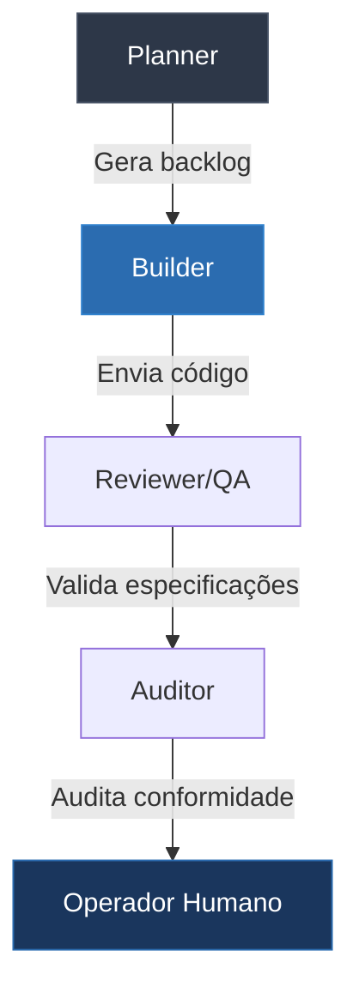
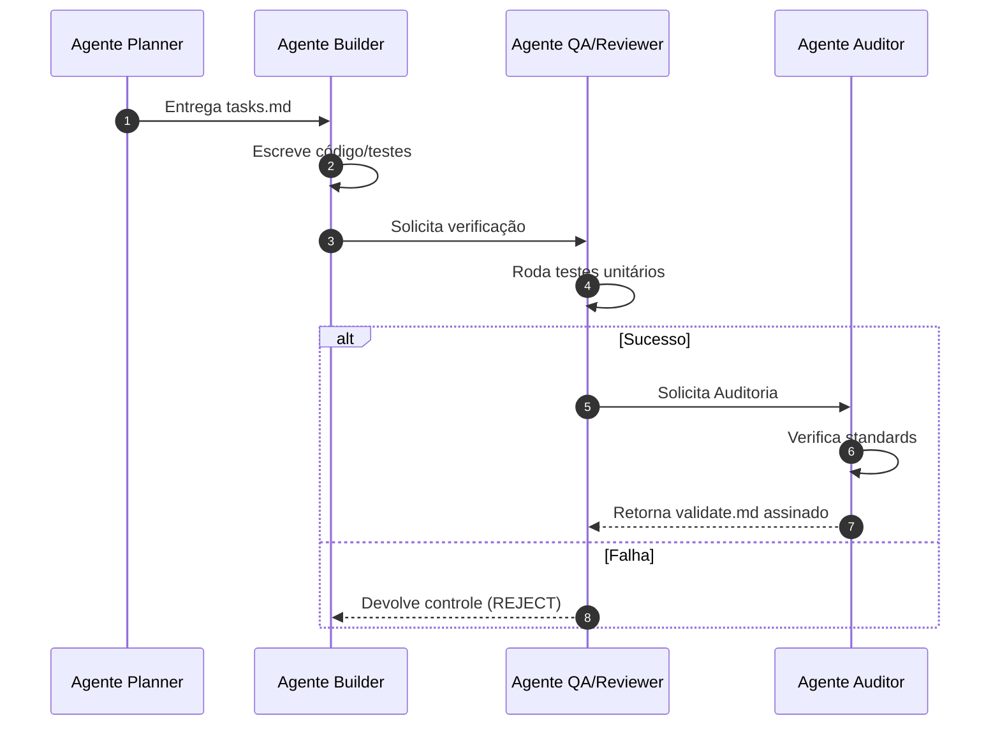

==================================================
OBJETIVO
==================================================

O módulo Agents do PromptCoreLabs_AEOS é responsável por gerenciar e definir os papéis de Inteligência Artificial especializados que operam no ecossistema.

Cada agente de IA representa um perfil técnico focado em responsabilidades delimitadas, garantindo que o trabalho de desenvolvimento, planejamento e auditoria ocorra sob governança estrita.

==================================================
POSIÇÃO ARQUITETURAL
==================================================

O módulo Agents situa-se na camada de inteligência operacional e consome dados das camadas superiores para realizar entregas no Runtime:

Foundation
↓
Governance
↓
Bootstrap
↓
Knowledge / Memory
↓
Agents
↓
Runtime

Os agentes não possuem autoridade de arquitetura ou autonomia para alterar políticas fundacionais. Eles operam como executores de tarefas de engenharia e são monitorados por auditorias de compliance.

==================================================
ESTRUTURA DO MÓDULO
==================================================

agents/
├── README.md                        ← este documento
│
├── definitions/
│   ├── README.md                    ← visão das definições de agentes
│   ├── planner.md                   ← especificações do agente Planner
│   ├── builder.md                   ← especificações do agente Builder
│   ├── reviewer-qa.md               ← especificações do Reviewer e QA
│   └── auditor.md                   ← especificações do agente Auditor
│
└── collaboration/
    ├── README.md                    ← visão da colaboração de agentes
    └── communication-protocols.md   ← protocolo de mensagens e intercâmbio

==================================================
PRINCÍPIOS OPERACIONAIS DOS AGENTES
==================================================

1. Especialização Máxima
   Agentes não devem misturar responsabilidades. Um agente Builder não planeja escopo de projeto; um agente Planner não codifica soluções.

2. Consumo de Conhecimento Desacoplado
   Agentes devem carregar conhecimento do Knowledge/ e RAG do Memory/, e não depender de prompts ou conjuntos de instruções estáticos gigantescos (system prompts) que geram desperdício de tokens.

3. Limitação de Autonomia e Gates
   Nenhum agente executa código ou altera Stage Gates sem aprovação final explícita do operador humano (Human-in-the-loop).

==================================================
DIAGRAMA DE DEPENDÊNCIAS DO SQUAD DE IA
==================================================

A hierarquia lógica de especialidades da squad:



==================================================
UML DE SEQUÊNCIA: TRANSIÇÃO DE CONTROLE
==================================================

Fluxo de comunicação e transições de estado de arquivos no ecossistema:



==================================================
GUIA QUICKSTART: CONFIGURAÇÃO DE SQUADS
==================================================

### Passo 1 — Configurar System Prompt do Agente
Para configurar os prompts de sistema recomendados de cada agente na sua aplicação de orquestração (PaperClip ou customizada), copie o conteúdo da seção `PROMPT DE SISTEMA RECOMENDADO` dos arquivos individuais:
```bash
# Exemplo para o Builder:
cat agents/definitions/builder.md
```

### Passo 2 — Verificar Protocolo de Mensagens
Quando os agentes precisam trocar contexto, certifique-se de que o payload respeita o formato estabelecido:
```bash
cat agents/collaboration/communication-protocols.md
```

==================================================
FONTES DE VERDADE
==================================================

foundation/FOUNDATION.md

architecture/modules.md

governance/roles.md

governance/decision-authority.md

