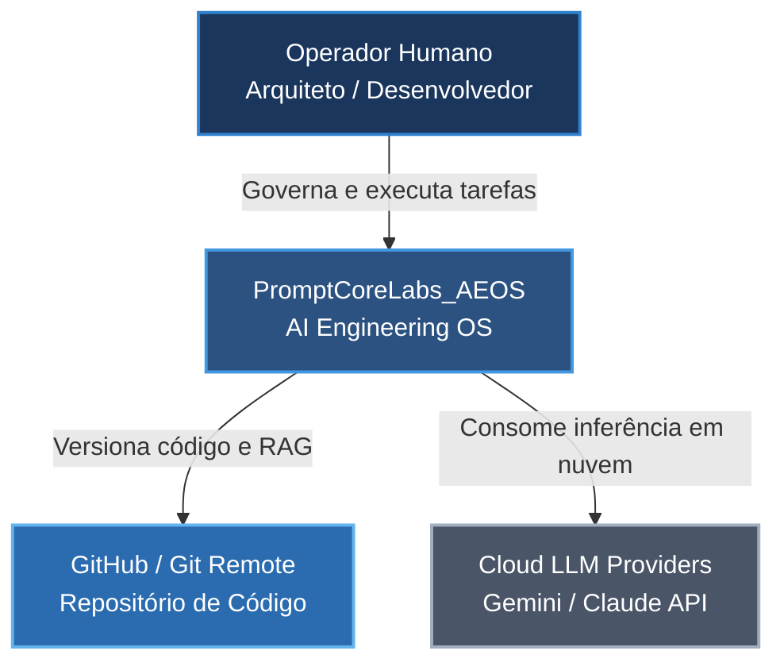
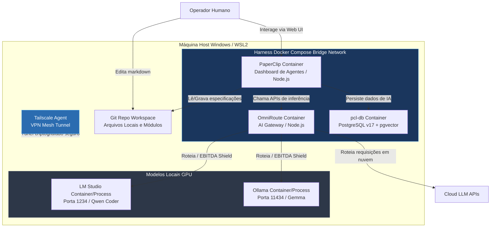
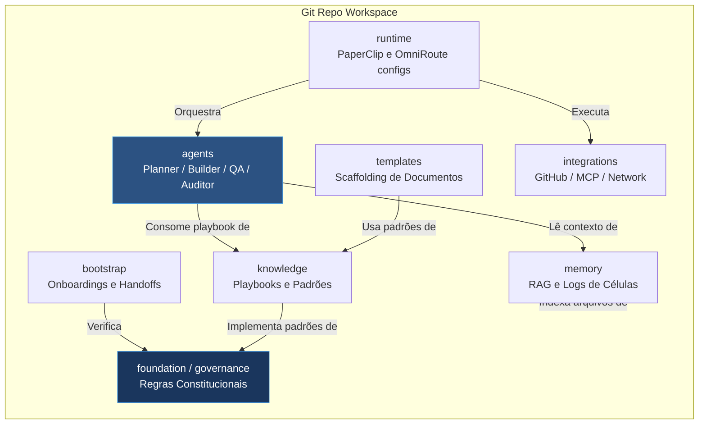

# ARCHITECTURE — C4 Model Architecture

==================================================
METADADOS
==================================================

| Campo | Valor |
|---|---|
| Documento | architecture/c4-model.md |
| Tipo | Documento Arquitetural Corporativo |
| Status | Aprovado |
| Versão | v1.0 |
| Camada | Architecture |
| Autoridade | Fonte Oficial de Verdade |

---

==================================================
1. INTRODUÇÃO AO C4 MODEL
==================================================

O modelo C4 é uma notação gráfica simplificada projetada para descrever a arquitetura de sistemas de software em diferentes níveis de abstração. Ele organiza a visualização em quatro níveis: Contexto, Contêineres, Componentes e Código.

Para o **PromptCoreLabs_AEOS**, o C4 Model é a ferramenta oficial de representação macro de processos lógicos e físicos, integrando a documentação e os fluxos computacionais locais do Harness.

---

==================================================
2. C4 NÍVEL 1 — SYSTEM CONTEXT (CONTEXTO DO SISTEMA)
==================================================

O diagrama de contexto mostra a fronteira do ecossistema AEOS com os atores humanos e os sistemas externos em nuvem:

### Elementos do Contexto:
*   **Operador Humano:** Engenheiros de IA e Desenvolvedores que utilizam a metodologia TLC e instanciam templates para guiar as decisões.
*   **PromptCoreLabs_AEOS:** O sistema em escopo que organiza e persiste o conhecimento corporativo e a orquestração local.
*   **GitHub / Git Remote:** Plataforma de nuvem para guarda, versionamento e controle colaborativo do código e especificações.
*   **Cloud LLM Providers:** Serviços externos de IA de alto contexto (Gemini Pro, Claude Sonnet) para tarefas analíticas densas.

---

==================================================
3. C4 NÍVEL 2 — CONTAINER DIAGRAM (CONTÊINERES)
==================================================

O diagrama de contêineres abre a caixa do AEOS, mostrando as aplicações físicas em execução local e suas pontes de rede:

### Detalhamento dos Contêineres:
*   **Git Repo Workspace (File System):** Contém os módulos do AEOS (Foundation, Governance, etc.) e as pastas ativas de `/projects/` e `/tools/`.
*   **PaperClip (Web App / Node.js):** Gerencia os agentes inteligentes e permite ao operador acompanhar os logs das squads de desenvolvimento.
*   **OmniRoute (API Proxy / Node.js):** Gateway de roteamento com suporte a fallback dinâmico e prompt caching (EBITDA Shield).
*   **pcl-db (Database / PostgreSQL v17):** Banco de dados relacional para persistência de sessões e vetorial para indexação do RAG da memória organizacional.
*   **LM Studio / Ollama (Local AI Engines):** Motores locais de inferência consumidos para tarefas de baixo custo ou sem conexão externa.

---

==================================================
4. C4 NÍVEL 3 — COMPONENT DIAGRAM (COMPONENTES DO REPOSITÓRIO)
==================================================

O diagrama de componentes detalha a organização lógica do repositório Git e como as dependências fluem:

---

==================================================
5. FONTES DE REFERÊNCIA
==================================================

architecture/architecture-map.md

architecture/principles.md

runtime/README.md
