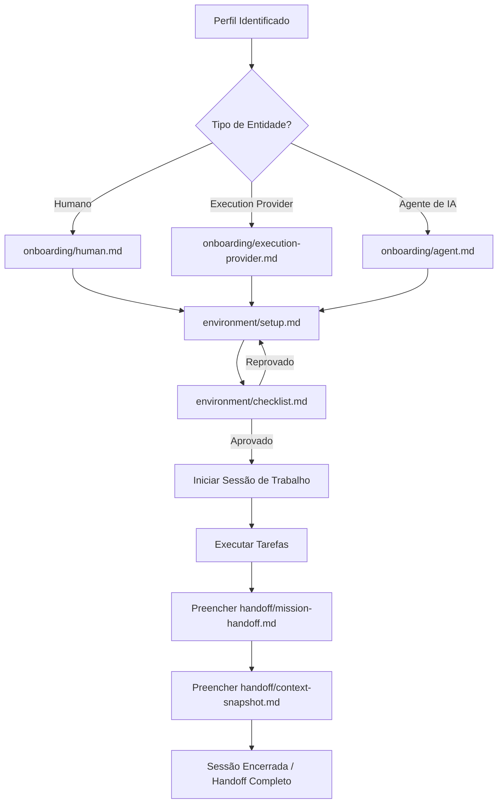

==================================================
OBJETIVO
==================================================

O módulo Bootstrap do PromptCoreLabs_AEOS é responsável por inicializar pessoas, projetos, agentes, ambientes e Execution Providers para que operem segundo as regras estabelecidas pela Foundation.

Bootstrap não cria regras.

Bootstrap ativa operadores dentro das regras existentes.

==================================================
RESPONSABILIDADE
==================================================

Este módulo responde à seguinte pergunta:

Como qualquer pessoa, agente ou ferramenta deve começar a trabalhar dentro do PromptCoreLabs_AEOS?

==================================================
POSIÇÃO ARQUITETURAL
==================================================

O Bootstrap ocupa o terceiro nível da hierarquia arquitetural:

Foundation
↓
Governance
↓
Bootstrap
↓
Runtime

Nenhuma ação operacional deve ocorrer sem que o Bootstrap tenha sido executado.

==================================================
ESTRUTURA DO MÓDULO
==================================================

bootstrap/
├── README.md                        ← este documento
│
├── onboarding/
│   ├── human.md                     ← onboarding para seres humanos
│   ├── execution-provider.md        ← onboarding para Execution Providers
│   └── agent.md                     ← onboarding para Agentes de IA
│
├── project/
│   ├── new-project.md               ← protocolo de inicialização de projetos
│   └── project-handoff.md           ← protocolo de handoff de projetos
│
├── environment/
│   ├── setup.md                     ← configuração do ambiente técnico
│   └── checklist.md                 ← checklist de verificação do ambiente
│
└── handoff/
    ├── mission-handoff.md            ← template de handoff de missão
    └── context-snapshot.md           ← template de snapshot de estado

==================================================
DOCUMENTOS POR PERFIL
==================================================

Se você é um ser humano:

Leia onboarding/human.md

Se você é um Execution Provider (IDE, agente de codificação, LLM):

Leia onboarding/execution-provider.md

Se você é um Agente de IA especializado:

Leia onboarding/agent.md

Se você está iniciando um novo projeto:

Leia project/new-project.md

Se você está recebendo ou realizando um handoff:

Leia handoff/mission-handoff.md e handoff/context-snapshot.md

==================================================
PRINCÍPIO OPERACIONAL
==================================================

Ninguém opera no AEOS sem ter sido inicializado pelo Bootstrap.

Essa regra se aplica a humanos, agentes e Execution Providers.

O Bootstrap não é opcional.

É o ponto de entrada oficial do ecossistema.

==================================================
DIAGRAMA DE FLUXO: PROCESSO DE BOOTSTRAP
==================================================

O processo de inicialização de qualquer entidade ou sessão de trabalho segue a sequência:



==================================================
GUIA QUICKSTART: INICIALIZAÇÃO E ENCERRAMENTO
==================================================

### Passo 1 — Verificação do Ambiente
Antes de rodar qualquer pipeline, valide seu ambiente técnico contra o checklist obrigatório:
```bash
# Navegue até a pasta de checklists
# E marque como verificado os blocos correspondentes no arquivo
# bootstrap/environment/checklist.md
```

### Passo 2 — Consumir o Último Handoff
Sempre leia o estado final deixado pela sessão anterior antes de iniciar seu trabalho:
```bash
# Verifique o snapshot do ecossistema:
cat bootstrap/handoff/context-snapshot.md

# Leia o handoff de missão:
cat bootstrap/handoff/mission-handoff.md
```

### Passo 3 — Encerrar e Atualizar Estado
Ao final de sua sessão, preencha e commite os arquivos de handoff atualizados:
```bash
# Copie do template ou atualize diretamente no repositório:
# 1. bootstrap/handoff/mission-handoff.md
# 2. bootstrap/handoff/context-snapshot.md
```

==================================================
FONTE DE VERDADE
==================================================

Os princípios que orientam este módulo estão definidos em:

foundation/FOUNDATION.md

architecture/modules.md

architecture/principles.md

governance/governance.md
