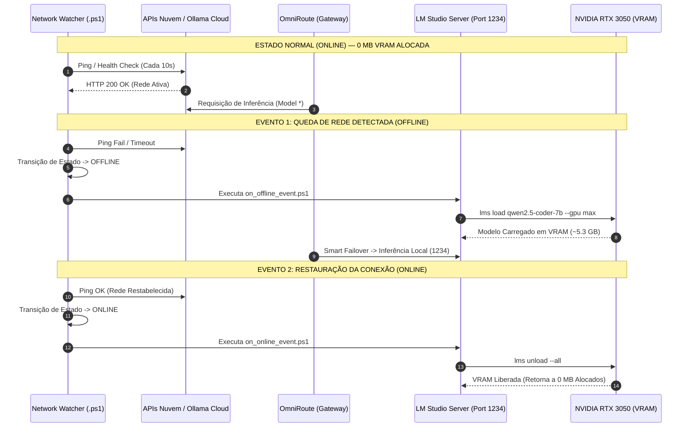
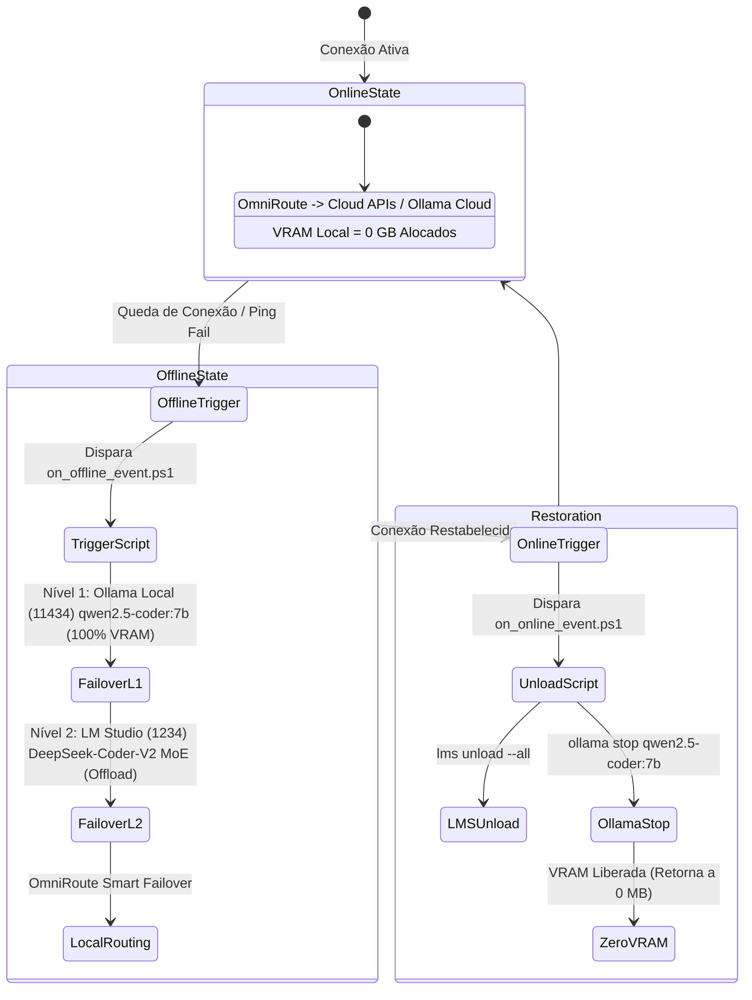

# Guia Oficial de Portabilidade de Hardware & Especificação de Scripts (PCL AEOS)

**Documento**: `docs/hardware-portability-guide.md`  
**Tipo**: Guia de Engenharia & Especificação de Portabilidade  
**Ecossistema**: PromptCoreLabs_AEOS v2.0 Sovereign  

---

## 🧭 Visão Geral

Este documento fornece as especificações completas de engenharia para implantar e executar o **PCL AEOS** em qualquer perfil de hardware (laptops, desktops, workstations e servidores). 

Ele detalha a arquitetura **Trigger-Based On-Demand Failover**, que garante **0 MB de VRAM alocada durante a execução online normal** e aciona o carregamento local de inferência apenas quando uma queda de rede/VPN for detectada.

---

## 🖥️ Matriz de Portabilidade e Perfis de Hardware (Hardware Scaling Matrix)

O PCL AEOS adapta-se dinamicamente ao perfil de hardware disponível. A tabela abaixo fornece os parâmetros ideais de quantização, contexto e alocação:

| Perfil de Hardware | VRAM / RAM | Modelo Local Indicado | Quantização | Context Window | Configuração de Load (`lms load`) |
| :--- | :--- | :--- | :--- | :--- | :--- |
| **Perfil 1: Ultra-Light** | 0-4 GB VRAM / 8-16 GB RAM | `gemma3:4b` / `Qwen2.5-Coder-1.5B` | `Q4_K_M` | 4096 tokens | `--gpu 0` (CPU Multi-thread) |
| **Perfil 2: Standard Laptop (Target LOQ)** | **6 GB VRAM** / **16 GB RAM DDR5** | **`Qwen2.5-Coder-7B-Instruct`** | **`Q4_K_M`** | **8192 tokens** | **`--gpu max --ttl 1800`** |
| **Perfil 3: Workstation** | 8-12 GB VRAM / 32 GB RAM | `Qwen2.5-Coder-14B` / `DeepSeek-Lite` | `Q5_K_M` | 16384 tokens | `--gpu max --ttl 3600` |
| **Perfil 4: High-End Server** | 16-24+ GB VRAM / 64+ GB RAM | `Qwen2.5-Coder-32B` / `DeepSeek-V2.5` | `Q6_K` / `fp16` | 32768 tokens | `--gpu max --ttl 0` |

---

## ⚡ Ciclo de Vida Reativo (Trigger-Based Sequence Diagram)



### 🔄 Máquina de Estados de Transição de VRAM (State Diagram)



---

## 📜 Especificação Detalhada dos Scripts de Automação (`scripts/windows/`)

### 1. `scripts/windows/watch_network_trigger.ps1`
* **Responsabilidade**: Daemon ultra-leve de monitoramento reativo da interface de rede.
* **Parâmetros**:
  * `-CheckIntervalSeconds` (Padrão: `10`): Intervalo de amostragem de ping.
  * `-TestEndpoints` (Padrão: `@("1.1.1.1", "8.8.8.8", "openrouter.ai")`): Endpoints testados para validação de conectividade.
  * `-LogFile`: Caminho do log em `logs/network_watcher.log`.
* **Execução**:
  ```powershell
  powershell -ExecutionPolicy Bypass -File "scripts/windows/watch_network_trigger.ps1" -CheckIntervalSeconds 10
  ```

### 2. `scripts/windows/on_offline_event.ps1`
* **Responsabilidade**: Gatilho de failover executado exclusivamente na perda de rede para orquestrar o failover local em 2 níveis.
* **Ações**:
  1. **Nível 1 (Alta Velocidade)**: Valida e garante prontidão do serviço Ollama na porta `11434` rodando `qwen2.5-coder:7b-instruct-q4_K_M` (100% alocado na VRAM de 6 GB).
  2. **Nível 2 (MoE / Refatoração)**: Garante prontidão do LM Studio Server na porta `1234` com suporte ao modelo `DeepSeek-Coder-V2-Lite-Instruct` com GPU Offload (VRAM + RAM DDR5).
* **Parâmetros**:
  * `-OllamaPort` (Padrão: `11434`)
  * `-OllamaModel` (Padrão: `"qwen2.5-coder:7b-instruct-q4_K_M"`)
  * `-LMSPort` (Padrão: `1234`)
  * `-LMSModel` (Padrão: `"deepseek-coder-v2-lite-instruct"`)

### 3. `scripts/windows/on_online_event.ps1`
* **Responsabilidade**: Gatilho de restauração executado ao retornar a conectividade de rede.
* **Ações**:
  1. Executa `lms unload --all` para descarregar instâncias do LM Studio.
  2. Executa `ollama stop <OllamaModel>` para descarregar modelos em memória no Ollama.
  3. Garante o retorno estrito de **0 MB de VRAM alocada** na GPU física (RTX 3050).
  4. Registra o evento de desalocação no log `logs/network_failover.log`.

---

## 🛠️ Guia de Portabilidade para Outros Ambientes

Ao migrar a pilha PCL AEOS para outra máquina:

1. **Ajuste de Modelo no Script**: Altere a variável `-ModelId` em `on_offline_event.ps1` para coincidir com a quantização suportada no seu hardware (conforme a Matriz de Portabilidade acima).
2. **Execução no Linux / MacOS**: Utilize scripts equivalentes em Bash (`watch_network_trigger.sh`) mantendo as mesmas chamadas à CLI do LM Studio (`lms`) ou Ollama (`ollama run`).
