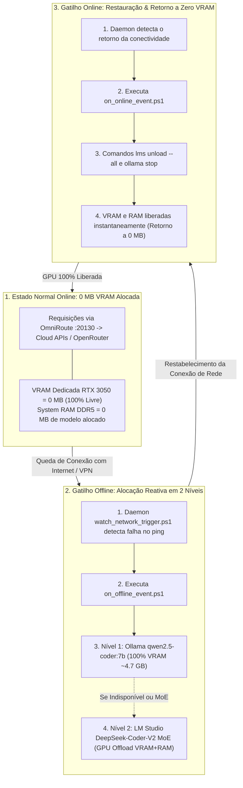

# Guia Técnico de Otimização de VRAM & Ciclo de Vida Reativo (PCL AEOS)

**Host Target**: Lenovo LOQ 15IAX9  
**Especificações do Host**:
* **CPU**: Intel Core i5-12450HX (8 núcleos / 12 threads)
* **RAM**: 16 GB DDR5 4800MHz
* **GPU**: NVIDIA GeForce RTX 3050 Laptop (6 GB VRAM GDDR6 Dedicada)
* **Armazenamento SSD**: ~78 GB livres
* **OS**: Windows 11 64-bit + Docker Desktop (WSL2 Engine)

---

## 1. Princípio Arquitetural: Alocação Reativa Sob Demanda (Trigger-Based)

Diferente de abordagens tradicionais que mantêm modelos pesados constantemente alocados na GPU (consumindo recursos do sistema durante a navegação/trabalho convencional), o **PCL AEOS** adota um **Ciclo de Vida Reativo baseado em Gatilhos de Estado**:

---

## 2. Dimensionamento de VRAM quando acionado no modo Offline

Quando o gatilho offline é disparado, a governança em 2 níveis garante estabilidade total sem estouro de VRAM na RTX 3050 (6 GB):

### Nível 1: `Qwen2.5-Coder-7B-Instruct (Q4_K_M)` no Ollama Local
* **Tamanho do Peso**: ~4.7 GB (Quantização `Q4_K_M`)
* **Camadas Offloaded para GPU**: 100% na VRAM (RTX 3050)
* **Context Window Ideal**: **8192 tokens** (~640 MB KV Cache)
* **Consumo Total VRAM**: ~4.7 GB / 6.00 GB (🟢 100% Seguro e Rápido)

### Nível 2: `DeepSeek-Coder-V2-Lite-Instruct (Q4_K_S)` no LM Studio
* **Tamanho do Peso**: ~8.88 GiB (Arquitetura MoE: 16B parâmetros totais / 2.4B ativos)
* **Alocação de Memória**: GPU Offload híbrido (camadas iniciais na VRAM e camadas complementares nos 16 GB de RAM DDR5)
* **Context Window Ideal**: **8192 tokens** com Flash Attention habilitado
* **Finalidade**: Refatorações extensas, arquitetura complexa e raciocínio profundo quando o Nível 1 não bastar

---

## 3. Scripts de Controle de Estado (`scripts/windows/`)

Os scripts automatizam a governança de hardware sem necessidade de intervenção humana:

1. **`watch_network_trigger.ps1`**: Monitor de conectividade em tempo real (amostragem a cada 10 segundos).
2. **`on_offline_event.ps1`**: Assegura a prontidão do Ollama (Porta 11434) e do LM Studio Server (Porta 1234).
3. **`on_online_event.ps1`**: Descarrega instantaneamente todos os modelos (`lms unload --all` e `ollama stop`), restaurando **0 MB de VRAM**.
