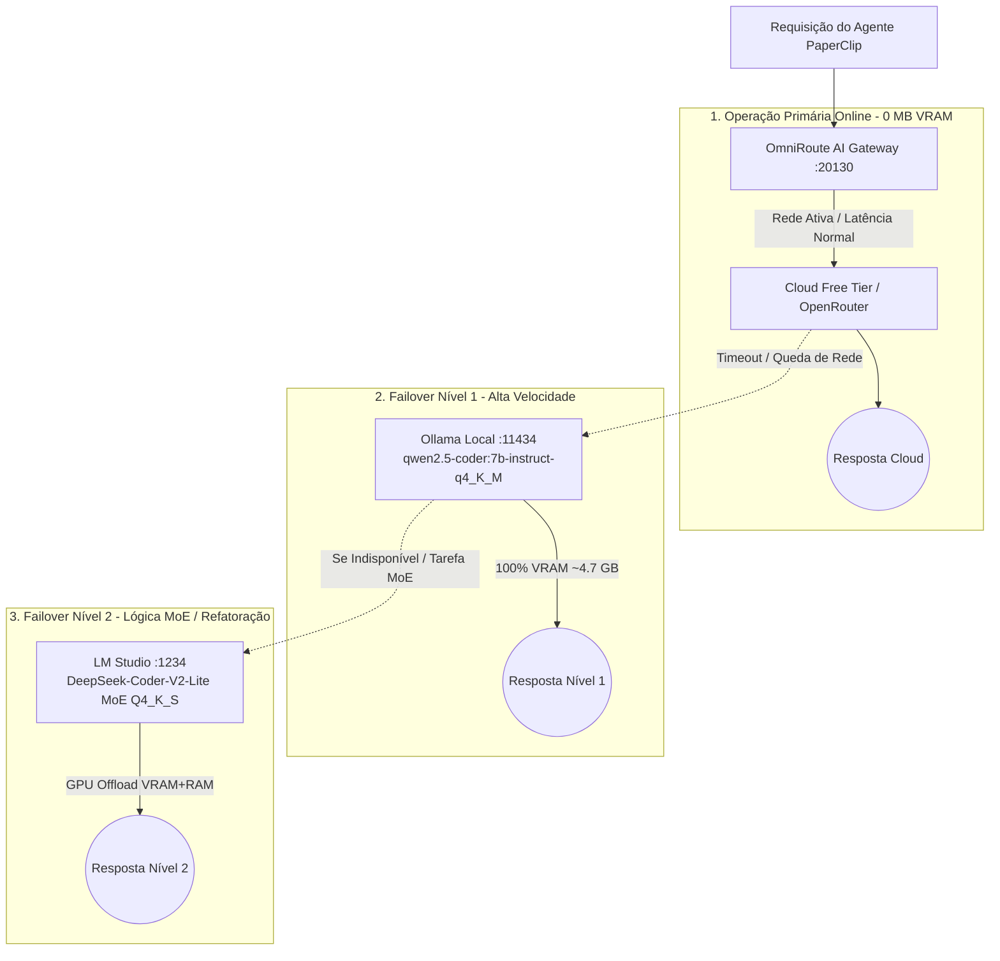
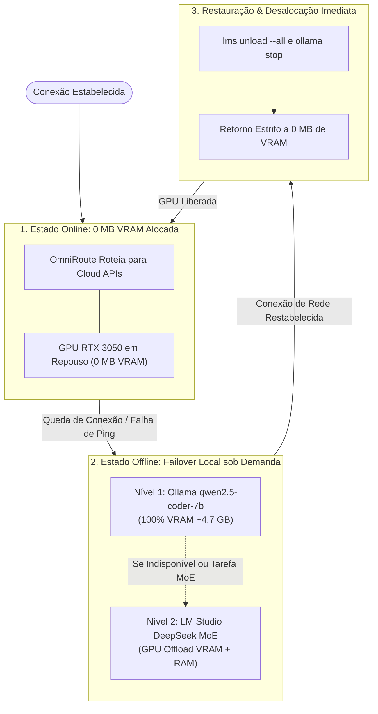

# Guia de Arquitetura: Inferência Híbrida & Failover em 2 Níveis (PCL AEOS)

---

## 🌟 Visão Geral & Filosofia de Engenharia

O **PromptCoreLabs_AEOS** opera sob um paradigma pioneiro de **Custo Marginal Zero ($0 Marginal Cost)** aliado à **Soberania Operacional Total**.

A infraestrutura de inferência foi projetada para eliminar o desperdício de energia e memória local quando há conexão com a internet, sem jamais comprometer a execução autônoma dos 15 agentes do PaperClip na ocorrência de interrupções de rede, bloqueios perimetrais ou falhas de APIs externas.



---

## 🏛️ Estrutura da Estratégia em 3 Camadas

### 1️⃣ Camada 1: Modo Online (Operação Contínua a Custo Zero)
* **Provedores Ativos**: Cloud Free Tier (OpenRouter, Groq, Ollama Cloud).
* **Consumo de Hardware Local**: **0 MB de VRAM Alocada** na GPU dedicada.
* **Mecanismo EBITDA Shield**: O gateway OmniRoute armazena hashes semânticos das requisições frequentes. Chamadas idênticas retornam direto do cache em memória sem consumo de tokens externos.

### 2️⃣ Camada 2: Failover Nível 1 — Ollama Local (Alta Velocidade)
* **Endpoint**: `http://localhost:11434/v1` (compatível com OpenAI API).
* **Modelo Homologado**: `qwen2.5-coder:7b-instruct-q4_K_M` (~4.7 GB GGUF).
* **Alocação de Hardware**: **100% alocado na VRAM** de 6 GB da NVIDIA GeForce RTX 3050.
* **Finalidade**: Respostas ultra-rápidas para autocompletar código, triagem de tarefas e execução de agentes secundários.

### 3️⃣ Camada 3: Failover Nível 2 — LM Studio (Lógica MoE & Refatoração Profunda)
* **Endpoint**: `http://localhost:1234/v1` (compatível com OpenAI API).
* **Modelo Homologado**: `deepseek-coder-v2-lite-instruct` (~8.88 GiB GGUF).
* **Arquitetura**: Mixture of Experts (16B parâmetros totais / 2.4B parâmetros ativos por token).
* **Alocação de Hardware**: **GPU Offload híbrido** (camadas iniciais aceleradas na VRAM de 6 GB e camadas de transição alocadas na memória RAM DDR5 do sistema de 16 GB), com Flash Attention ativado e janela de contexto em 8192 tokens.
* **Finalidade**: Refatorações arquiteturais extensas, escrita de testes ponta a ponta e geração de código complexo.

---

## 🔄 Ciclo de Vida Reativo & Governança de Memória (VRAM)

O estado de alocação da GPU transita dinamicamente entre zero e máxima performance:



### Automação via PowerShell (`scripts/windows/`):

1. **`watch_network_trigger.ps1`**: Monitor contínuo de conectividade (amostragem a cada 10 segundos).
2. **`on_offline_event.ps1`**: Disparado no instante da queda de sinal, garante a prontidão imediata do Ollama na porta `11434` e a inicialização do LM Studio Server na porta `1234`.
3. **`on_online_event.ps1`**: Disparado no instante em que o sinal de internet/VPN retorna, invoca `lms unload --all` e `ollama stop qwen2.5-coder:7b-instruct-q4_K_M`, liberando integralmente a GPU para **0 MB de VRAM**.

---

## 🛠️ Comandos de Auditoria e Inspeção no Host

```powershell
# 1. Verificar modelos instalados no Ollama Local
ollama list

# 2. Verificar modelos registrados no LM Studio
lms ls

# 3. Testar inferência direta no Nível 1 (Ollama)
curl.exe -s -X POST http://localhost:11434/v1/chat/completions `
  -H "Content-Type: application/json" `
  -d '{"model": "qwen2.5-coder:7b-instruct-q4_K_M", "messages": [{"role": "user", "content": "ping"}], "max_tokens": 5}'

# 4. Descarregar todos os modelos e restaurar baseline de 0 MB VRAM
powershell -ExecutionPolicy Bypass -File "scripts/windows/on_online_event.ps1"
```

---

## 🖥️ Requisitos para Portabilidade em Outro Hardware

| Perfil de Máquina | VRAM / RAM Mínima | Configuração Recomendada |
| :--- | :--- | :--- |
| **Standard Laptop (Alvo LOQ)** | **6 GB VRAM / 16 GB RAM DDR5** | Nível 1: `qwen2.5-coder:7b` (100% VRAM) + Nível 2: `deepseek-coder-v2-lite` (GPU Offload) |
| **Workstation / PC Gamer** | 12 GB VRAM / 32 GB RAM | Nível 1: `qwen2.5-coder:14b` + Nível 2: `DeepSeek-Coder-V2` completo em VRAM |
| **Servidor Sem GPU Dedicada** | 0 GB VRAM / 32 GB RAM | Execução em CPU multi-threading via Ollama com quantizações `Q4_K_M` |
