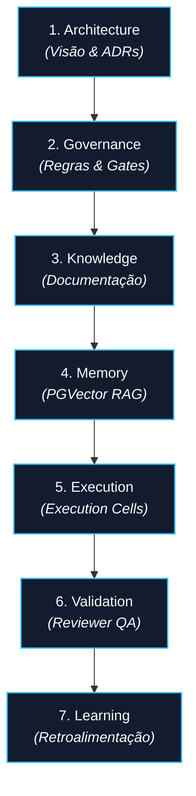
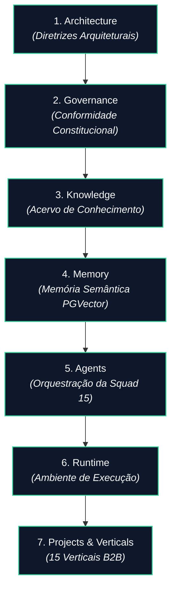
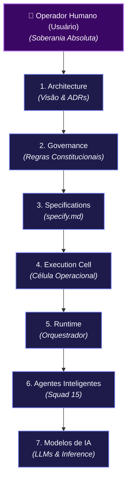
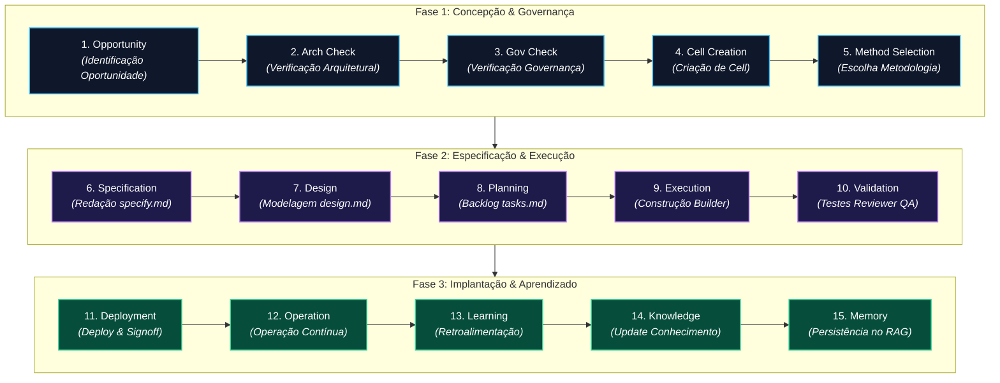

# GOVERNANCE — Operating Model

## Metadados

| Campo | Valor |
|--------|-------|
| Documento | governance/operating-model.md |
| Tipo | Documento Fundacional de Governança |
| Status | Aprovado pelo Usuário |
| Versão | 2.0 |
| Camada | Governance |
| Autoridade | Fonte Oficial de Verdade |

---

# Objetivo

Este documento define o modelo operacional oficial do PromptCoreLabs_AEOS.

Seu propósito é estabelecer como iniciativas evoluem desde sua concepção até sua operação contínua através da colaboração coordenada entre pessoas, agentes, modelos de IA e ferramentas.

O Operating Model define **como o AEOS trabalha**.

Metodologias definem **como cada iniciativa é conduzida**.

---

# Missão Operacional

Permitir que qualquer iniciativa seja desenvolvida de forma estruturada, rastreável, auditável e evolutiva, utilizando Inteligência Artificial como aceleradora da engenharia, nunca como substituta da responsabilidade arquitetural.

---

## 📐 Padrão Oficial de Legibilidade e Impressão de Diagramas (Standard)

Todo artefato visual e diagramação no ecossistema PCL-AEOS deve obrigatoriamente seguir este padrão inviolável:

1. **Quebra de Linha em Rótulos (` `)**: Rótulos e descrições de nós no Mermaid devem utilizar quebras de linha explícitas (` `) e formatação em itálico/subtítulos para expandir a altura das caixas e garantir que as fontes sejam renderizadas em tamanho amplo e legível sem extrapolar margens.
2. **Orientação por Domínio**:
   - Organogramas, árvores hierárquicas e matrizes de agentes devem utilizar estritamente **orientação vertical (`graph TD`)**.
   - Pipelines lineares de precedência e etapas de ciclo de vida devem utilizar **orientação horizontal (`graph LR`)**.
3. **Normalização de Escala de Impressão (`@media print`)**: As regras de exportação/impressão em PDF não podem clamping arbitrários de altura (`max-height`). O layout visual deve expandir a 100% da largura útil da folha A4 com fontes legíveis de no mínimo `13pt/14px`.

---

# Princípios Operacionais

Toda operação deverá obedecer rigorosamente à seguinte precedência:

Nenhuma automação poderá inverter esta ordem.

---

# Modelo Operacional

O AEOS opera sobre sete capacidades permanentes:

Cada camada fornece capacidades para a camada seguinte.

Nenhuma camada inferior redefine responsabilidades das superiores.

Conforme registrado no [ADR-005](file:///c:/PromptCore_Labs/docs/adr/ADR-005-multi-vertical-ai-holding-monetization-model.md), a Camada 7 (`Projects & Verticals`) opera no modelo de **Holding Digital AI-Orchestrated (3 Camadas: Plataforma -> 15 Verticais B2B -> Produtos/SaaS)**, alavancando os clusters de agentes especializados para entregar serviços e produtos recorrentes com custo marginal zero.

## 🏛️ O Modelo em 3 Camadas da Holding Digital PCL

```mermaid
graph TD
    classDef platform fill:#131b2e,stroke:#38bdf8,stroke-width:1.5px,color:#f8fafc;
    classDef verticals fill:#0f172a,stroke:#34d399,stroke-width:1.5px,color:#f8fafc;
    classDef products fill:#1e1b4b,stroke:#c084fc,stroke-width:1.5px,color:#f8fafc;

    subgraph Layer1["Camada 1: Plataforma Core PCL-AEOS ($0 Custo Marginal)"]
        Cortex["🧠 Cortex Engine<br/><i>(Arch Intelligence)</i>"]:::platform
        OmniRoute["⚡ OmniRoute :20130<br/><i>(EBITDA Shield)</i>"]:::platform
        Paperclip["🤖 Paperclip :3100<br/><i>(Orchestration)</i>"]:::platform
        RAG["💾 PGVector RAG<br/><i>(Shared Memory)</i>"]:::platform
        TLCSkills["🛠️ TLC Agent Skills<br/><i>(Skills Engine)</i>"]:::platform
    end

    subgraph Layer2["Camada 2: 15 Verticais de Negócio B2B (Profit Centers)"]
        V1["1. Software Studio"]:::verticals
        V2["2. Marketing & Growth"]:::verticals
        V3["3. RevOps & CRM"]:::verticals
        V4["4. AI Consulting"]:::verticals
        V5["5. Data & Analytics"]:::verticals
        V6["6. AI Academy"]:::verticals
        V7["7. Jurídico & Compliance"]:::verticals
        V8["8. RH & People Ops"]:::verticals
        V9["9. FinOps & Pricing"]:::verticals
        V10["10. Customer Success"]:::verticals
        V11["11. Mídia & Podcasts"]:::verticals
        V12["12. Venture Studio"]:::verticals
        V13["13. DevSecOps Studio"]:::verticals
        V14["14. E-Commerce Pricing"]:::verticals
        V15["15. GovTech & RFP"]:::verticals
    end

    subgraph Layer3["Camada 3: Modelos de Monetização & Produtos"]
        P1["📦 Proposta / Projeto Fechado"]:::products
        P2["🔄 Retainers Mensais"]:::products
        P3["🚀 Micro-SaaS White-Label"]:::products
        P4["🔌 APIs & Agentes"]:::products
        P5["🎓 Assinaturas Academy"]:::products
    end

    Layer1 --> Layer2
    Layer2 --> Layer3
```

---

# Unidade Operacional

A menor unidade operacional do PromptCoreLabs_AEOS é denominada **Execution Cell**.

Uma Execution Cell representa um ambiente operacional completo e governado, responsável por executar uma iniciativa, módulo ou etapa do ciclo de vida da plataforma.

Ela encapsula:

- responsabilidade humana;
- agentes especializados;
- modelos de IA;
- contexto compartilhado;
- metodologia ativa;
- artefatos;
- memória operacional;
- observabilidade.

Toda execução do AEOS deverá ocorrer dentro de uma Execution Cell.

A especificação completa das Execution Cells pertence à camada Runtime.

---

# Papéis Operacionais

O modelo operacional reconhece cinco categorias de participantes.

## Sponsor

Define objetivos.

Prioridades.

Critérios de sucesso.

Aprova resultados.

---

## Architect

Mantém:

- Vision
- Principles
- Modules
- ADRs
- Decision Framework

Possui autoridade arquitetural.

---

## Builder

Constrói soluções aprovadas.

Nunca altera arquitetura.

---

## Reviewer

Audita qualidade.

Conformidade.

Segurança.

Rastreabilidade.

---

## Operator

Mantém operação contínua.

Observabilidade.

Aprendizado.

Retroalimentação do sistema.

---

# Colaboração Operacional

Humanos, agentes e modelos nunca trabalham isoladamente.

Eles colaboram através de Execution Cells.

A Execution Cell fornece:

- isolamento de contexto;
- governança;
- memória compartilhada;
- metodologia ativa;
- rastreabilidade;
- continuidade operacional.

Isso elimina dependência da memória individual de um agente ou modelo.

---

# Papéis da Inteligência Artificial

Os modelos de IA assumem papéis especializados.

Exemplos:

- Planner
- Architect Assistant
- Builder Assistant
- Reviewer Assistant
- QA Assistant
- Documentation Assistant
- RAG Assistant
- Orchestrator

Esses papéis podem variar conforme a metodologia utilizada.

Nenhum agente possui autoridade arquitetural.

---

## Mapeamento de Agentes, Sub-Agentes e Distribuição de Skills

A execução operacional do PCL-AEOS é conduzida por uma Squad de **15 Agentes Especialistas**, cujas responsabilidades e habilidades são distribuídas em 4 camadas funcionais (para consulta detalhada, veja o [Manual dos Agentes](file:///c:/PromptCore_Labs/projects/Living%20Architecture%20PCL%20AEOS/docs/agents-squads/README.md)):

1. **Squad Core de Engenharia (Spec-Driven Loop)**:
   - **Planner Agent**: Decomposição de especificações (`specify.md`) e planejamento de backlog (`tasks.md`).
   - **Builder Agent**: Escrita cirúrgica de código, refatoração e geração de diffs.
   - **Reviewer QA**: Testes adversários, execução de suítes de teste e validação de regressão.
   - **Auditor Agent**: Compliance constitucional, verificação de segredos e selamento dos Stage Gates.

2. **Squad de Estratégia & Arquitetura**:
   - **Strategist_One**: OKRs corporativos, visão do produto e métricas North Star.
   - **Lead TLC Engineer**: Manutenção da arquitetura viva, governança C4 e motor Cortex Archify.

3. **Squad SecOps, FinOps & Infraestrutura**:
   - **CISO Security Agent**: Segurança Zero Trust, sanitização de chaves e imunização Mesh Tailscale.
   - **BizOps Controller**: Monitoramento da cadência de sprints e gargalos de fluxo no Paperclip.
   - **Financial Advisor**: Auditoria de FinOps e controle de custos de inferência (EBITDA Shield no OmniRoute).

4. **Squad Data, Growth, LegalOps & People**:
   - **RevOps Architect**: Funil de aquisição GTM, conversão de Micro-SaaS e retenção B2B.
   - **Data Insight Agent**: RAG relacional, indexação de vetores (PGVector) e pipelines de ML.
   - **Neuromarketing Strategist**: Branding, copywriting de auto-conversão e identidade visual.
   - **Compliance Steward**: Jurídico, normas de privacidade (LGPD/GDPR) e governança contratual.
   - **Skills Manager**: Gestão da matriz de competências dos agentes, skills e onboarding.

---

# Responsabilidades

## Humanos

- definir objetivos;
- aprovar arquitetura;
- aprovar governança;
- aprovar entregas;
- aceitar riscos.

---

## Agentes

- executar tarefas;
- produzir documentação;
- gerar código;
- revisar artefatos;
- sugerir melhorias;
- detectar inconsistências.

---

## Runtime

- criar Execution Cells;
- coordenar workflows;
- distribuir tarefas;
- executar pipelines;
- registrar eventos;
- controlar fallback;
- preservar contexto.

---

# Modelo de Autoridade

Toda decisão segue obrigatoriamente a hierarquia soberana vertical abaixo:

Nenhuma camada inferior poderá ultrapassar a autoridade de uma camada superior.

---

# Fluxo Operacional

Toda iniciativa percorre o seguinte fluxo sequencial em 3 fases:

Cada transição exige critérios explícitos.

---

# Seleção de Metodologia

O AEOS suporta múltiplas metodologias.

Exemplos:

- TLC Spec-Driven v3
- Shape Up
- Architecture Kata
- Event Storming
- futuras metodologias

A metodologia é um componente operacional.

Nunca um fundamento arquitetural.

---

# Modelo de Conhecimento

Durante toda a operação coexistem dois fluxos.

## Conhecimento Explícito

Documentação.

Templates.

Playbooks.

Guias.

Padrões.

---

## Conhecimento Computacional

Embeddings.

RAG.

Memória contextual.

Histórico operacional.

Índices.

Ambos devem permanecer sincronizados.

---

# Modelo de Execução

O Runtime coordena.

As Execution Cells executam.

Os agentes colaboram.

Os modelos raciocinam.

As integrações conectam.

Os projetos recebem valor.

---

# Modelo de Aprendizado

Ao término de cada iniciativa deverão ser avaliados:

- novos ADRs;
- novos padrões;
- novos templates;
- novos playbooks;
- melhorias metodológicas;
- evolução da arquitetura.

Todo aprendizado retorna para:

- Knowledge;
- Memory;
- Governance;
- Architecture.

---

# Estratégia Multi-Modelo

O AEOS é completamente agnóstico quanto aos modelos de IA.

Modelos cloud, locais ou híbridos poderão coexistir.

A substituição de um modelo nunca deverá exigir alterações arquiteturais.

---

# Estratégia de Fallback

Quando um modelo não puder atender uma solicitação:

1. preservar o contexto da Execution Cell;
2. registrar o evento;
3. selecionar modelo alternativo;
4. manter rastreabilidade;
5. continuar a execução.

O fallback nunca poderá modificar arquitetura, escopo ou aprovações.

---

# Observabilidade

Toda operação deverá gerar evidências.

Exemplos:

- logs;
- eventos;
- decisões;
- aprovações;
- métricas;
- auditorias.

Nenhuma informação crítica deverá depender exclusivamente da memória de um agente ou modelo.

---

# Estado Operacional

Este documento estabelece o modelo operacional oficial do PromptCoreLabs_AEOS.

Toda metodologia, Runtime, agente, integração, projeto ou ferramenta deverá operar dentro de uma Execution Cell e em conformidade com os princípios definidos neste documento.
