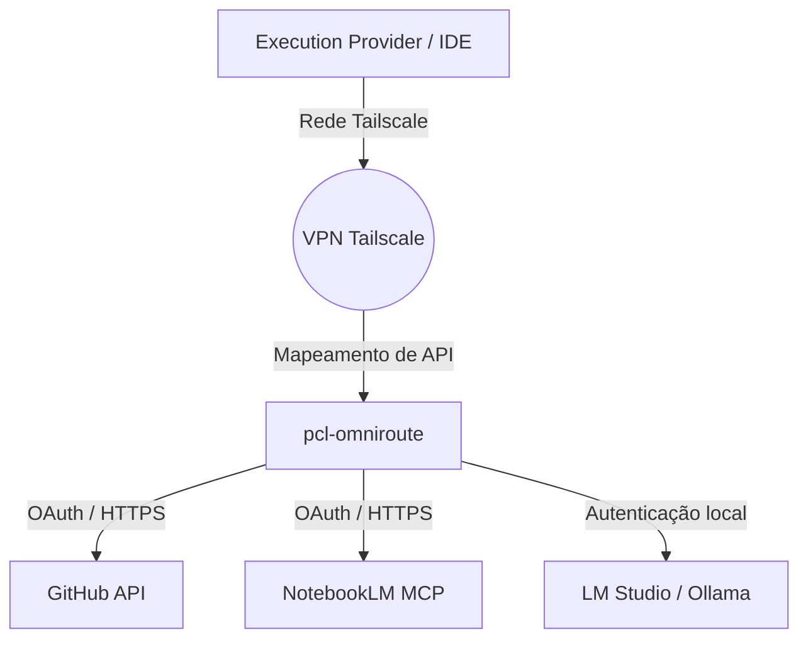

==================================================
OBJETIVO
==================================================

O módulo Integrations do PromptCoreLabs_AEOS documenta todas as integrações oficiais e aprovadas entre a plataforma e serviços externos, ferramentas e redes.

Este módulo é a ponte controlada e rastreável entre o ecossistema AEOS e o mundo externo.

==================================================
POSIÇÃO ARQUITETURAL
==================================================

O módulo Integrations é a penúltima camada do fluxo do conhecimento arquitetural, posicionada diretamente antes dos Projects:

Runtime
↓
Models
↓
Integrations
↓
Projects

Integrações não definem arquitetura. Elas implementam pontes de comunicação entre o Runtime e serviços externos.

==================================================
ESTRUTURA DO MÓDULO
==================================================

integrations/
├── README.md                        ← este documento
│
├── github/
│   ├── README.md                    ← visão da integração com o GitHub
│   └── repository-conventions.md    ← convenções de branches, commits e PRs
│
├── mcp/
│   ├── README.md                    ← visão dos servidores MCP configurados
│   └── notebooklm.md                ← integração com o NotebookLM MCP Server
│
└── network/
    ├── README.md                    ← visão da integração de rede
    └── tailscale.md                 ← configuração da rede privada Tailscale

==================================================
PRINCÍPIOS DE INTEGRAÇÃO
==================================================

1. Toda integração deve ser documentada aqui antes de ser implementada no Runtime.

2. Nenhuma integração deve criar dependência exclusiva de um único fornecedor.

3. Credenciais e chaves de API referenciadas nas integrações devem ser gerenciadas via variáveis de ambiente nos containers Docker.

==================================================
DIAGRAMA DE FLUXO: ARQUITETURA DE INTEGRAÇÃO
==================================================

Como as conexões e pontes externas interagem com a rede local:



==================================================
GUIA QUICKSTART: VERIFICAÇÃO DE INTEGRAÇÕES
==================================================

### Passo 1 — Testar Conexão Tailscale
Para verificar se o seu nó local do Tailscale está ativo e enxergando os demais dispositivos da rede privada:
```bash
tailscale status
```

### Passo 2 — Diagnóstico de Conexão com o GitHub
Verifique se a sua conta está devidamente autenticada e conectada ao GitHub via CLI:
```bash
# Executa do diretório root
.\tools\gh\bin\gh.exe auth status
```

### Passo 3 — Verificar API do OmniRoute
Testar se o proxy está interceptando e autenticando requisições no endpoint de saúde:
```bash
curl http://localhost:20130/health
```

==================================================
FONTES DE REFERÊNCIA
==================================================

foundation/FOUNDATION.md

architecture/modules.md

runtime/README.md

