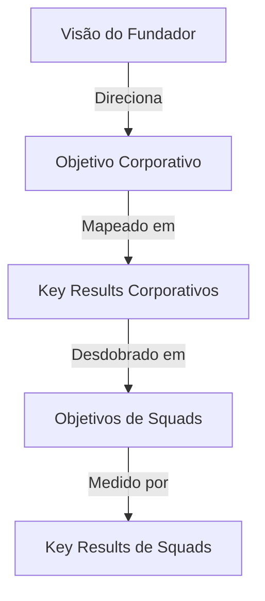

# METHODOLOGY PLAYBOOK — OKR & Strategic Planning

==================================================
METADADOS
==================================================

| Campo | Valor |
|---|---|
| Documento | knowledge/playbooks/methodologies/okr-strategic-planning.md |
| Tipo | Playbook de Processo Corporativo |
| Status | Aprovado |
| Versão | v1.0 |
| Camada | Knowledge |
| Autoridade | Strategist_One |

---

==================================================
1. GESTÃO ESTRATÉGICA POR OKR
==================================================

Os OKRs (Objectives and Key Results) são usados na PromptCore Labs para alinhar as ações operacionais dos squads com a visão de longo prazo do fundador.

### 📌 Estrutura do OKR
*   **Objetivo (O):** Descrição qualitativa e aspiracional do que queremos alcançar (ex: "Consolidar a liderança técnica em automação cognitiva").
*   **Resultados-Chave (KR):** Metas quantitativas e mensuráveis que indicam o progresso em direção ao Objetivo (ex: "Alcançar 90% de market-fit nas propostas de projetos do ciclo").

---

==================================================
2. ROTEIRO DE CONSULTA E PROCESSOS
==================================================

### Passo 1 — Definição Trimestral (Q-Planning)
Ao início de cada ciclo de 90 dias, o Strategist_One reúne-se com o BizOps_Controller e o fundador humano para definir de 2 a 3 objetivos macro.

### Passo 2 — Cascateamento de Metas (Alignment)
Cada squad define seus próprios KRs de suporte aos KRs institucionais.
*   **Exemplo:** O squad de Vibe-Coding cria KRs técnicos para acelerar o tempo de build em 20% com o intuito de apoiar o KR institucional de produtividade.

### Passo 3 — Acompanhamento Semanal (Weekly Check-in)
BizOps_Controller conduz rituais de 15 minutos para medir o andamento de cada KR.

---

==================================================
3. MODELO DE ALINHAMENTO
==================================================

