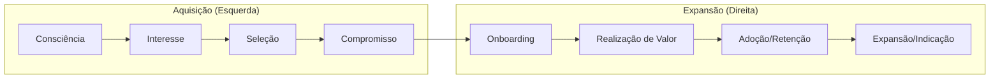

# METHODOLOGY PLAYBOOK — RevOps (Bowtie & SPICED)

==================================================
METADADOS
==================================================

| Campo | Valor |
|---|---|
| Documento | knowledge/playbooks/methodologies/revops-bowtie-spiced.md |
| Tipo | Playbook de Processo de Vendas e CS |
| Status | Aprovado |
| Versão | v1.0 |
| Camada | Knowledge |
| Autoridade | RevOps_Architect |

---

==================================================
1. MODELO BOWTIE (FUNIL GTM INTEGRADO)
==================================================

O modelo Bowtie (Gravata Borboleta) da Winning by Design substitui o funil de vendas tradicional por um fluxo contínuo focado no LTV (Lifetime Value). Ele reconhece que a geração de valor real e receita ocorre **após** a assinatura do contrato (retenção e expansão).

---

==================================================
2. METODOLOGIA DE QUALIFICAÇÃO SPICED
==================================================

O framework SPICED é utilizado por agentes de RevOps para guiar a qualificação e conversão de leads:

*   **S — Situation (Situação):** O contexto de fatos e dados do cliente.
*   **P — Pain (Dor):** O problema de negócio que impede o cliente de crescer.
*   **I — Impact (Impacto):** O ganho financeiro ou operacional de resolver a dor (ou o custo de não fazer nada).
*   **C — Critical Event (Evento Crítico):** O prazo ou evento que força uma decisão.
*   **E — Decision Criteria (Critérios de Decisão):** Como o cliente avalia a solução.
*   **D — Decision Process (Processo de Decisão):** Quem são as pessoas que aprovam a compra.
