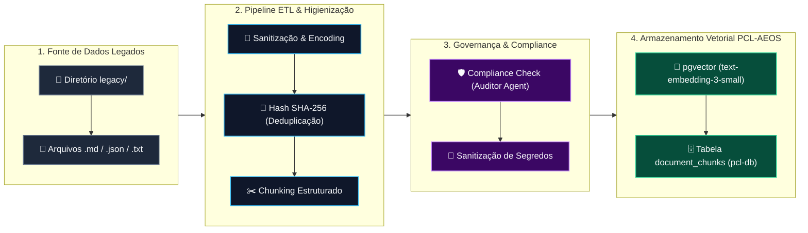

# 🔄 DIAG-LEG-01: Legacy Migration Dataflow & Modernização de Dados Legados

> **Especificação Técnica do Sistema Operacional PCL-AEOS**  
> **ID**: `DIAG-LEG-01` | **Categoria**: Dataflow Architecture | **Prioridade**: `P2 Médio`  
> **Escopo**: Sanitização, Extração, Deduplicação e Ingestão do Acervo Legado (`legacy/`)

---

## 📌 1. Visão Geral do Pipeline

O pipeline **DIAG-LEG-01 (Legacy Migration Dataflow)** rege a transição segura e auditada de todo o acervo histórico contido no diretório `legacy/` para o modelo de memória operacional do PCL-AEOS.

Ele garante que documentos legados, especificações obsoletas e artefatos não estruturados sejam higienizados, deduplicados e convertidos para os esquemas relacionais e vetoriais do banco `pcl-db` (PGVector), prevenindo alucinações e mantendo o rastreio da linhagem original.

---

## 🛠️ 2. Fases do Processo de Migração

### Fase 1: Extração & Sanitização
- **Varredura Ativa**: Mapeamento completo dos arquivos do diretório `legacy/`.
- **Limpeza de Formatação**: Remoção de caracteres de controle inválidos, correção de encodings e padronização para UTF-8.
- **Deduplicação por Hash**: Geração de assinatura SHA-256 para cada arquivo para evitar indexação duplicada no repositório vetorial.

### Fase 2: Fragmentação & Vetorização (RAG Ingestion)
- **Chunking Semântico**: Divisão do conteúdo em blocos de até 512 tokens com overlap de 50 tokens, preservando o contexto dos parágrafos.
- **Enriquecimento de Metadados**: Cada fragmento recebe as tags obrigatórias: `source_file`, `legacy_path`, `migrated_at` e `sha256_hash`.
- **Geração de Embeddings**: Conversão em vetores de 768 dimensões via modelo padrão OmniRoute.

### Fase 3: Auditoria de Governança (Stage Gate 3)
- **Varredura de Segredos**: O **CISO Security Agent** intercepta o payload verificando ausência de chaves de API, senhas ou dados sensíveis (LGPD/GDPR).
- **Selamento Constitucional**: Inserção dos registros auditados na tabela relacional `document_chunks` com marcação de proveniência legada.

---

## 📊 3. Modelo de Dados da Migração Legada

| Campo em `document_chunks` | Tipo SQL | Função no Dataflow Legado |
| :--- | :--- | :--- |
| `id` | `UUID` | Identificador único do chunk migrado |
| `source_file` | `VARCHAR(512)` | Caminho original do arquivo em `legacy/` |
| `content` | `TEXT` | Texto higienizado do fragmento legado |
| `embedding` | `vector(768)` | Representação vetorial densa para busca por cosseno |
| `metadata` | `JSONB` | Contém `sha256`, `is_legacy: true` e `migrated_at` |

---

## 🔗 Documentos Relacionados
- [Diagrama Interativo DIAG-LEG-01](file:///c:/PromptCore_Labs/projects/Living%20Architecture%20PCL%20AEOS/diagrams/interactive/data-legacy-migration.html)
- [Arquitetura de Memória & RAG Vetorial](file:///c:/PromptCore_Labs/projects/Living%20Architecture%20PCL%20AEOS/docs/memory-rag/README.md)
- [Governança & Modelo Operacional v2.0](file:///c:/PromptCore_Labs/governance/operating-model.md)
