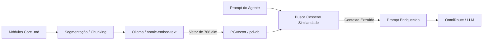
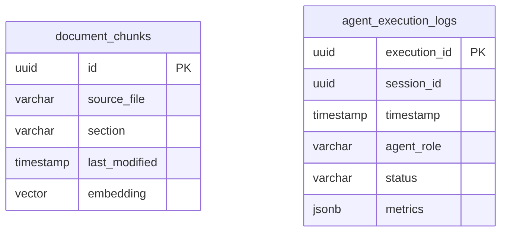

==================================================
OBJETIVO
==================================================

O módulo Memory do PromptCoreLabs_AEOS é responsável pela memória organizacional, persistência computacional, contexto persistente, indexação de RAG e caches semânticos da plataforma.

Toda a persistência de conhecimento ativo dos agentes e do Runtime é gerenciada a partir deste módulo.

==================================================
POSIÇÃO ARQUITETURAL
==================================================

O módulo Memory está situado na camada de suporte ao conhecimento e inteligência operacional:

Foundation
↓
Governance
↓
Bootstrap
↓
Knowledge / Memory
↓
Agents

A Memory trabalha em estreita colaboração com o Knowledge. Enquanto o Knowledge armazena documentação legível por humanos e playbooks estáticos, a Memory armazena índices lógicos, bancos vetoriais e logs históricos legíveis por máquinas e interpretados por agentes de IA.

==================================================
ESTRUTURA DO MÓDULO
==================================================

memory/
├── README.md                        ← este documento
│
├── rag/
│   ├── README.md                    ← princípios de RAG no AEOS
│   ├── vector-infrastructure.md     ← especificações de banco de dados vetorial
│   └── indexing-rules.md            ← regras de processamento e chunks de dados
│
└── context/
    ├── README.md                    ← papel do contexto persistente
    └── execution-history.md         ← persistência do histórico de Execution Cells

==================================================
PRINCÍPIOS DA MEMÓRIA
==================================================

1. Persistência Desacoplada
   A memória existe de forma separada do ciclo de vida das sessões dos agentes. A destruição ou reinicialização de um contêiner de agente não deve corromper a base de conhecimento persistente.

2. Soberania e Local-First
   Os índices vetoriais e dados de contexto devem ser armazenados localmente e criptografados, em conformidade com as regras de governança e segurança do AEOS.

3. Rastreabilidade de Origem
   Cada elemento indexado na memória vetorial deve apontar de volta para o arquivo fonte original do repositório, garantindo que o agente possa auditar a fonte primária.

==================================================
DIAGRAMA DE FLUXO: PIPELINE DE RAG LOCAL
==================================================

Processamento de documentos e busca semântica na infraestrutura local do Harness:



==================================================
DIAGRAMA ERD: METADADOS DE VETORES E LOGS
==================================================

Modelagem lógica das estruturas armazenadas na memória persistente:



==================================================
GUIA QUICKSTART: DIAGNÓSTICO DO BANCO VETORIAL
==================================================

### Passo 1 — Verificar se a Extensão pgvector está Habilitada
Para garantir que o `pcl-db` está pronto para busca vetorial, execute no terminal do host (ou dentro do container):
```bash
# Conecte ao banco de dados do contêiner:
docker exec -it pcl-db psql -U paperclip -d paperclip -c "SELECT extname FROM pg_extension WHERE extname = 'vector';"
```

### Passo 2 — Testar Embedding via Ollama Local
Para testar a conversão de um texto em representação vetorial utilizando a API do Ollama local:
```bash
curl http://localhost:11434/api/embeddings -d '{
  "model": "nomic-embed-text",
  "prompt": "Princípios fundamentais do ecossistema AEOS"
}'
```

==================================================
FONTES DE REFERÊNCIA
==================================================

foundation/FOUNDATION.md

architecture/modules.md

architecture/principles.md

