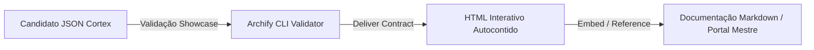

==================================================
METADADOS DE ARQUITETURA E DESIGN (DESIGN)
==================================================

Tipo: Desenho Técnico e Arquitetura da Living Architecture
Escopo: Living Architecture PCL AEOS
Status: DESIGN APPROVED
Data: 2026-07-30
Versão: v1.0
Autor: Cortex / PromptCore Labs

==================================================
1. ARQUITETURA DE VISUALIZAÇÃO E DOCUMENTAÇÃO
==================================================

A Living Architecture do PCL AEOS utiliza um modelo híbrido de visualização:
1. **Camada de Documentação Estática (Markdown)**: Centralizada em `docs/` organizada por domínios e conectada pelo portal mestre `README.md`.
2. **Camada de Diagramação Dinâmica e Interativa (Cortex Archify Engine)**: Renderização baseada em especificações JSON com compilador CLI `node bin/archify.mjs`, produzindo arquivos HTML autocontidos na pasta `diagrams/interactive/`.



==================================================
2. DECOMPOSIÇÃO DE COMPONENTES DO PORTAL
==================================================

```
projects/Living Architecture PCL AEOS/
├── README.md                           # Portal Mestre (Landing Page)
├── .specs/                             # Especificações TLC v3
│   ├── specify.md
│   ├── design.md
│   ├── tasks.md
│   └── validate.md
├── docs/                               # 9 Módulos do Conhecimento
│   ├── strategy/                       # Visão, Princípios e Decisões
│   ├── c4-model/                       # Especificações C4 (L1, L2, L3, L4)
│   ├── infrastructure/                 # Harness, Docker, Tailscale, Local GPU
│   ├── runtime/                        # OmniRoute, Routing, Models
│   ├── governance/                     # TLC v3, Stage Gates, ADRs
│   ├── memory-rag/                     # PGVector 17, Vector Store, Lineage
│   ├── agents-squads/                  # 15 Roles, PaperClip, RACI
│   ├── integrations-mcp/               # Servidores MCP, GitHub, Network
│   ├── security-compliance/            # Zero Trust, Secret Management, CISO
│   ├── adrs/                           # Arquivos de ADRs Aprovados
│   └── glossary/                       # Dicionário de Termos PCL AEOS
└── diagrams/
    ├── interactive/                    # Entregáveis HTML Interativos do Cortex
    └── assets/                         # Artefatos SVG/PNG exportados
```

==================================================
3. FLUXO DE COMPILAÇÃO E VALIDAÇÃO DOS DIAGRAMAS
==================================================

Cada diagrama interativo segue rigorosamente o pipeline de entrega do Cortex:
1. **Autoria JSON**: Escrever a topologia no formato JSON específico da modalidade (`architecture`, `workflow`, `sequence`, `dataflow`, `lifecycle`).
2. **Validação Showcase**: `node bin/archify.mjs validate <tipo> <candidato.json> --quality showcase --json` (exige 9/9 verificações e 0 erros).
3. **Entrega Atomic (`deliver`)**: `node bin/archify.mjs deliver <tipo> <candidato.json> <saida.html> --quality showcase --json`.

==================================================
4. MATRIZ DE RASTREABILIDADE (TRACEABILITY MATRIX)
==================================================

| ID Requisito (FR/NFR) | Componente da Solução | Artefato / Arquivo Alvo | Diagrama Associado |
|---|---|---|---|
| **LARCH-FR-001** | Portal Mestre | `README.md` (root do projeto) | `DIAG-C4-01` (C4 L1 Context) |
| **LARCH-FR-002** | Estrutura de Documentação | `docs/*` (9 subdiretórios) | Todos os 18 diagramas |
| **LARCH-FR-003** | Catálogo de Diagramas | `README.md` (Seção Catálogo) | Inventário completo `DIAG-C4-01` a `DIAG-C4-04` |
| **LARCH-FR-004** | Motor Interativo Cortex | `diagrams/interactive/*.html` | `c4-l1-context.html`, `c4-l2-containers.html`, etc. |
| **LARCH-FR-005** | Metodologia TLC Spec-Driven | `.specs/*` | Suíte completa em `.specs/` |
| **LARCH-NFR-001** | Notação C4 Model | `docs/c4-model/*` | `DIAG-C4-01` a `DIAG-C4-04` |
| **LARCH-NFR-002** | Qualidade Showcase | CLI Archify (`archify.mjs`) | Validação CLI 100% aprovada |
| **LARCH-NFR-003** | Idioma Português (BR) | Todos os artefatos | Rótulos e textos em PT-BR |
| **LARCH-NFR-004** | Execution Sovereign Local | Repositório local | Isolação local em `projects/` |
