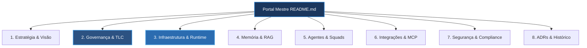

# Living Architecture PCL AEOS — Portal Mestre da Arquitetura

==================================================
BEM-VINDO À ARQUITETURA VIVA DO PCL AEOS
==================================================

Este portal é a **Única Fonte de Verdade (Single Source of Truth)** para a visualização, navegação, governança e evolução técnica do **PromptCoreLabs_AEOS** (AI Engineering Operating System). 

Conduzido pela inteligência arquitetural **Cortex**, este projeto constitui uma **Living Documentation** (Documentação Viva e Dinâmica), onde todos os artefatos e diagramas derivam de uma única visão consistente, conectando o plano estratégico de negócios até a infraestrutura física de contêineres e modelos de IA.

---

## 🏛️ Navegação por Níveis do C4 Model

| Nível C4 | Nome da Camada | Foco e Abstração | Artefatos e Diagramas Interativos |
|---|---|---|---|
| **C4 Level 1** | **System Context** | Visão macro de atores humanos (Operador), o AEOS, repositórios e serviços de nuvem. | [Contexto L1](docs/c4-model/l1-context.md) • `diagrams/interactive/c4-l1-context.html` |
| **C4 Level 2** | **Container Diagram** | Topologia física dos contêineres Docker (`pcl-db`, `pcl-omniroute`, `pcl-paperclip`), GPUs e Tailscale VPN. | [Contêineres L2](docs/c4-model/l2-containers.md) • `diagrams/interactive/c4-l2-containers.html` |
| **C4 Level 3** | **Component Diagram** | Decomposição das 10 camadas do repositório Git, fluxo do conhecimento e integrações MCP. | [Componentes L3](docs/c4-model/l3-components.md) • `diagrams/interactive/c4-l3-components.html` |
| **C4 Level 4** | **Code & Process Spec** | Schemas JSON, interfaces de ferramentas do Cortex Engine e contratos de agentes. | [Código L4](docs/c4-model/l4-code-specs.md) • `diagrams/interactive/c4-l4-cortex-engine.html` |

---

## 🧭 Navegação por Domínios Arquiteturais



### ÍNDICE DE MÓDULOS DE DOCUMENTAÇÃO DE DOMÍNIO (`docs/`)

- 🎯 **[Estratégia & Visão](docs/strategy/README.md)** — Visão corporativa, OKRs, North Star Metric e princípios fundacionais.
- 📐 **[Modelo C4 & Diagramas](docs/c4-model/README.md)** — Níveis C4 (L1 Contexto, L2 Contêineres, L3 Componentes, L4 Código) e 18 diagramas interativos.
- 🤖 **[Agents & Squads](docs/agents-squads/README.md)** — Manual de especificação detalhada dos 15 Agentes, papéis executivos e matriz RACI.
- 🧠 **[Memory & RAG Vetorial](docs/memory-rag/README.md)** — Pipeline de ingestão RAG, chunking, embeddings de 768 dimensões e PGVector no PostgreSQL 17.
- 🐳 **[Infraestrutura & Docker Harness](docs/infrastructure/README.md)** — Contêineres Docker (`pcl-db`, `pcl-omniroute`, `pcl-paperclip`), GPUs locais e Tailscale.
- ⚡ **[Runtime & AI Gateway OmniRoute](docs/runtime/README.md)** — Roteamento de inferência, EBITDA Shield, PaperClip Dashboard e fallback dinâmico.
- 🛡️ **[Governança TLC Spec-Driven v3](docs/governance/README.md)** — Matriz dos 5 Stage Gates sequenciais e regras de aprovação atômica.
- 🔌 **[Integrações & Protocolo MCP](docs/integrations-mcp/README.md)** — Servidores MCP (`pcl-cortex`, `gemini-notebooklm`) e protocolo de ferramentas stdio.
- 🔒 **[Segurança & Compliance Zero Trust](docs/security-compliance/README.md)** — Diretriz Zero Secret Leak, varreduras do CISO Agent e isolamento perimetral.
- 📜 **[ADRs & Decisões Arquiteturais](docs/adrs/README.md)** — Registros imutáveis das decisões históricas (ADR-0001 a ADR-0007).
- 📖 **[Glossário & Taxonomia Oficial](docs/glossary/README.md)** — Dicionário completo de termos técnicos da plataforma PCL AEOS.


1. **[Estratégia & Visão](docs/strategy/README.md)**
   - [Visão Corporativa e Missão](docs/strategy/vision-and-mission.md)
   - [Princípios Fundacionais PCL AEOS](docs/strategy/principles.md)
   - [Matriz de Decisão Arquitetural](docs/strategy/decision-matrix.md)

2. **[Governança & Metodologia TLC](docs/governance/README.md)**
   - [Metodologia TLC Spec-Driven v3](docs/governance/tlc-spec-driven.md)
   - [Matriz de Stage Gates (1 a 5)](docs/governance/stage-gates.md)
   - [Padrões de ADR e Compliance](docs/governance/adr-policy.md)

3. **[Infraestrutura & Runtime](docs/infrastructure/README.md)**
   - [Harness Docker Compose & Serviços](docs/infrastructure/docker-harness.md)
   - [OmniRoute AI Gateway & EBITDA Shield](docs/infrastructure/omniroute-gateway.md)
   - [Rede Mesh & Tunelamento Tailscale](docs/infrastructure/tailscale-network.md)
   - [Inferência Local GPU (LM Studio / Ollama)](docs/infrastructure/local-gpu-models.md)

4. **[Memória & RAG](docs/memory-rag/README.md)**
   - [Arquitetura PGVector PostgreSQL 17 (`pcl-db`)](docs/memory-rag/pgvector-architecture.md)
   - [Linhagem de Dados e Indexação Vetorial](docs/memory-rag/vector-lineage.md)
   - [Janelas de Contexto e Histórico de Sessão](docs/memory-rag/context-history.md)

5. **[Agentes Inteligentes & Squads](docs/agents-squads/README.md)**
   - [Inventário dos 15 Papéis de Agentes](docs/agents-squads/agents-inventory.md)
   - [PaperClip Squad Orchestration Dashboard](docs/agents-squads/paperclip-dashboard.md)
   - [Matriz RACI e Protocolos de Colaboração](docs/agents-squads/raci-matrix.md)
   - [PCL Cortex Engine e Skill de Arquitetura](docs/agents-squads/cortex-engine.md)

6. **[Integrações & Servidores MCP](docs/integrations-mcp/README.md)**
   - [Servidor MCP `pcl-cortex`](docs/integrations-mcp/pcl-cortex-mcp.md)
   - [Servidor MCP `gemini-notebooklm`](docs/integrations-mcp/notebooklm-mcp.md)
   - [Integração GitHub & Pipelines](docs/integrations-mcp/github-integration.md)

7. **[Segurança, Privacidade & Compliance](docs/security-compliance/README.md)**
   - [Arquitetura Zero Trust & Sanitização QA](docs/security-compliance/zero-trust.md)
   - [Gestão de Variáveis e Segredos (`.env`)](docs/security-compliance/secret-management.md)
   - [Políticas CISO e Auditoria Adversária](docs/security-compliance/ciso-policies.md)

8. **[ADRs & Registros de Decisão](docs/adrs/README.md)**
   - [Índice de ADRs Aprovados](docs/adrs/index.md)

9. **[Glossário & Taxonomia](docs/glossary/README.md)**
   - [Glossário de Termos e Siglas do PCL AEOS](docs/glossary/glossary-terms.md)

---

## 📊 Catálogo Mestre de Diagramas (Architecture Catalog)

Abaixo está o inventário completo dos 18 diagramas planejados no plano arquitetural, organizados por prioridade:

| Status | ID | Diagrama | Dimensão C4 / Tipo | Prioridade | Artefato de Renderização |
|---|---|---|---|---|---|
| ✅ **Concluído** | **DIAG-C4-01** | System Context Diagram | C4 Level 1 (Context) | **P0 (Crítico)** | [c4-l1-context.html](diagrams/interactive/c4-l1-context.html) |
| ✅ **Concluído** | **DIAG-C4-02** | Harness Container Topology | C4 Level 2 (Containers) | **P0 (Crítico)** | [c4-l2-containers.html](diagrams/interactive/c4-l2-containers.html) |
| ✅ **Concluído** | **DIAG-C4-03** | Repository Component Breakdown | C4 Level 3 (Components) | **P0 (Crítico)** | [c4-l3-components.html](diagrams/interactive/c4-l3-components.html) |
| ✅ **Concluído** | **DIAG-SEQ-01** | TLC Spec-Driven Execution Loop | Workflow / Sequence | **P0 (Crítico)** | [seq-tlc-execution.html](diagrams/interactive/seq-tlc-execution.html) |
| ✅ **Concluído** | **DIAG-SEQ-02** | OmniRoute LLM Request Lifecycle | Sequence Diagram | **P1 (Alto)** | [seq-omniroute-routing.html](diagrams/interactive/seq-omniroute-routing.html) |
| ✅ **Concluído** | **DIAG-DAT-01** | RAG & Memory Data Lineage | Dataflow Diagram | **P1 (Alto)** | [data-rag-memory.html](diagrams/interactive/data-rag-memory.html) |
| ✅ **Concluído** | **DIAG-LIF-01** | PCL Cortex Micro-Loop Lifecycle | State Machine / Lifecycle | **P1 (Alto)** | [life-cortex-micro-loop.html](diagrams/interactive/life-cortex-micro-loop.html) |
| ✅ **Concluído** | **DIAG-INF-01** | Network & Security Topology | Infrastructure | **P1 (Alto)** | [infra-network-security.html](diagrams/interactive/infra-network-security.html) |
| ✅ **Concluído** | **DIAG-AGT-01** | Squad Orchestration & Roles | Component / Workflow | **P1 (Alto)** | [agents-squad-map.html](diagrams/interactive/agents-squad-map.html) |
| ✅ **Concluído** | **DIAG-MCP-01** | MCP Server Interconnection Map | Component / Dataflow | **P2 (Médio)** | [mcp-interconnection.html](diagrams/interactive/mcp-interconnection.html) |
| ✅ **Concluído** | **DIAG-BS-01** | Bootstrap & Onboarding Pipeline | Workflow Diagram | **P2 (Médio)** | [workflow-bootstrap-onboarding.html](diagrams/interactive/workflow-bootstrap-onboarding.html) |
| ✅ **Concluído** | **DIAG-GOV-01** | Governance & Stage Gates Matrix | Workflow Diagram | **P2 (Médio)** | [gov-stage-gates-matrix.html](diagrams/interactive/gov-stage-gates-matrix.html) |
| ✅ **Concluído** | **DIAG-DEV-01** | Developer Experience & IDE Loop | Sequence Diagram | **P2 (Médio)** | [seq-devex-loop.html](diagrams/interactive/seq-devex-loop.html) |
| ✅ **Concluído** | **DIAG-LEG-01** | Legacy Migration Dataflow | Dataflow Diagram | **P2 (Médio)** | [data-legacy-migration.html](diagrams/interactive/data-legacy-migration.html) |
| ✅ **Concluído** | **DIAG-PRJ-01** | Projects Taxonomy & Isolation | Component Diagram | **P3 (Evolutivo)** | [c4-l3-projects-taxonomy.html](diagrams/interactive/c4-l3-projects-taxonomy.html) |
| ✅ **Concluído** | **DIAG-SEC-01** | Secret Management & Zero Trust | Infrastructure / Security | **P3 (Evolutivo)** | [sec-zero-trust-flow.html](diagrams/interactive/sec-zero-trust-flow.html) |
| ✅ **Concluído** | **DIAG-OBS-01** | Observability & Audit Trail | Dataflow / Lifecycle | **P3 (Evolutivo)** | [obs-audit-trail.html](diagrams/interactive/obs-audit-trail.html) |
| ✅ **Concluído** | **DIAG-C4-04** | Code-Level Class & Interface Specs | C4 Level 4 (Code) | **P3 (Evolutivo)** | [c4-l4-cortex-engine.html](diagrams/interactive/c4-l4-cortex-engine.html) |

---

## 📜 Metodologia TLC Spec-Driven do Próprio Projeto

Este projeto é governado através do seu próprio diretório de especificações [.specs](.specs/):
- 📄 [specify.md](.specs/specify.md) — Escopo, Requisitos Funcionais (FR) e Não Funcionais (NFR).
- 📄 [design.md](.specs/design.md) — Arquitetura de visualização e Matriz de Rastreabilidade.
- 📄 [tasks.md](.specs/tasks.md) — Backlog atômico de execução incremental.
- 📄 [validate.md](.specs/validate.md) — Relatórios de QA e auditoria de aceitação.

---

## 🛠️ Governança e Regras de Atualização

1. **Rastreabilidade Única**: Nenhuma alteração nos diagramas deve ser feita sem a devida atualização nos arquivos de especificação correspondentes em `docs/`.
2. **Motor Cortex CLI**: Os diagramas interativos em HTML usam o motor `Archify Engine` e são validados via CLI:
   ```bash
   node bin/archify.mjs validate <tipo> <candidato.json> --quality showcase --json
   node bin/archify.mjs deliver <tipo> <candidato.json> <saida.html> --quality showcase --json
   ```
3. **Imutabilidade de Histórico**: Registros em `docs/adrs/` são imutáveis após aprovação do gate. Novas decisões requerem uma nova ADR substituindo ou complementando a anterior.

---
*Living Architecture PCL AEOS v1.0 — Conduzido por Cortex — PromptCore Labs 2026*
