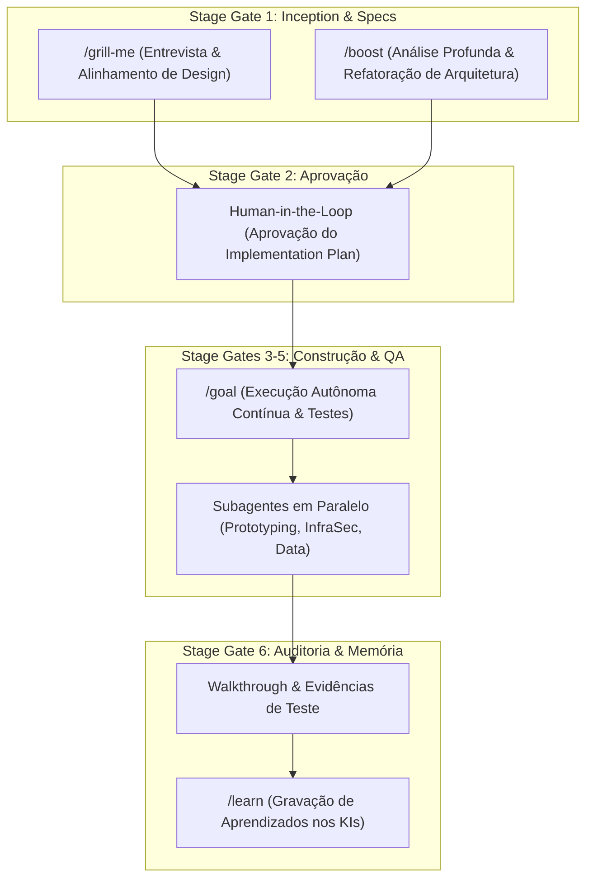

# ADR-0010: Refatoração da Squad Prototyping e Integração Auditável do Antigravity Harness

* **Status**: Accepted
* **Data**: 17/09/2026
* **Decisores**: Arquitetura PCL AEOS, Eduardo Machado & Antigravity Harness
* **Domínio**: Governança de Agentes, Estrutura de Squads, Harness IDE, Auditabilidade ISO 42001 / ISO 27001
* **Refines / Extends**: ADR-0007 (Metodologia TLC v3) e ADR-0009 (Triage Gate Dual-Track SDD)

---

## 1. Contexto e Problema

Com a maturação da governança **TLC v3 (Spec-Driven Development)** no PCL AEOS, o termo legacy `squad-vibe-coding` tornou-se desalinhado com os princípios formais de Engenharia de Software e arquitetura corporativa. A prática informal de "vibe coding" foi substituída pelo rigor de especificações (Lean Specs e Full SDD), tornando necessária a evolução conceitual da squad para **`squad-prototyping`** (Squad de Prototipagem de Aplicações).

Adicionalmente, havia a necessidade de integrar as **ferramentas e capacidades nativas do Antigravity IDE** (como Browser Subagent com gravação de vídeos WebP, Geração de Imagens/Mockups, Ciência de Dados GCP e comandos slash `/goal`, `/boost`, `/grill-me`) diretamente ao ecossistema do PCL AEOS, garantindo **rastreabilidade total e auditabilidade sob as normas ISO 42001 e ISO 27001**.

---

## 2. Decisão Arquitetural

Decidiu-se pelas seguintes ações constitutivas no ecossistema PCL AEOS:

1. **Renomeação e Re-estruturação de Squad**:
   * Substituição oficial de `squad-vibe-coding` por **`squad-prototyping`** em todo o repositório, Paperclip (`.paperclip.yaml`), ADRs e documentação.
   * A `squad-prototyping` assume a responsabilidade de construir Provas de Conceito (PoCs), protótipos de alta fidelidade e MVPs de aplicações sob rigor TLC v3.

2. **Acoplamento dos Colaboradores Nativos Antigravity às Squads**:
   * **`squad-prototyping`**: Recebe `generate_image` (Design de UI), `StitchMCP` (Design System Engine) e padrões `building-data-apps`.
   * **`squad-infra-sec`**: Recebe `browser_subagent` (Testes E2E reais com evidências em vídeo WebP) e scans de segurança GCS/Docker.
   * **`squad-growth-ds`**: Recebe a suíte BigData GCP (`bigquery-sql`, `bigquery-ai-ml`, `gcp-spark`, `gcp-dataflow`).
   * **`bot-agile-master` & Governança**: Recebe a gestão de Planning Mode (`implementation_plan.md`, `walkthrough.md`) e o comando `/learn` para preservação contínua de memória nos Knowledge Items (KIs).

3. **Mapeamento de Comandos Slash ao Ciclo TLC v3**:
   * **`/grill-me`**: Ativado no Stage Gate 1 / 2 para alinhamento e aprovação do Tech Lead.
   * **`/boost`**: Ativado para raciocínio profundo e solução de problemas de arquitetura complexos.
   * **`/goal`**: Ativado nos Stage Gates 3 a 5 para execução contínua com auto-correção e bateria de testes automatizados.

4. **Auditabilidade & Compliance ISO 42001 / 27001**:
   * Todos os logs de execução de subagentes, comandos de terminal e alterações são gravados em arquivos auditáveis em formato JSONL (`transcript_full.jsonl`).
   * O artefato `implementation_plan.md` com autorização explícita constitui o registro de *Human-in-the-Loop (HitL)* para a ISO 42001.

---

## 3. Consequências e Validação

* **Vantagens**:
  * **Alinhamento Conceitual**: Eliminação do termo informal "vibe coding", elevando o padrão para Engenharia de Software e Prototipagem de nível corporativo.
  * **PCL AEOS como Fonte Única de Verdade**: O Antigravity IDE atua como o motor de execução das Squads sem criar regras paralelas ou fragmentadas.
  * **Auditabilidade Completa**: Atendimento imediato a requisitos de compliance e auditoria interna/externa (ISO 42001/27001).
