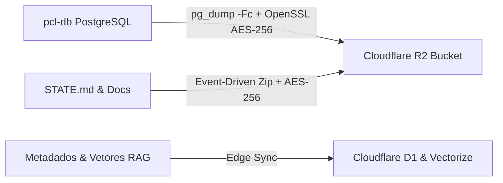

# ADR-006: Memória Tripartida, Plano de Recuperação de Desastres (DRP) e Cloudflare Zero Trust Integration

* **Status**: Aprovado e Implementado
* **Data**: Rastreável via histórico de commits Git
* **Decisores**: Arquitetura PCL AEOS & Cortex Intelligence
* **Domínio**: Infraestrutura, Resiliência, Backup, Cloudflare R2/D1/Vectorize, MCP

---

## 1. Contexto e Problema

O ecossistema **PromptCoreLabs_AEOS** necessitava de uma solução sovereign para prescrever, armazenar e recuperar o estado de seus contêineres (`pcl-db` PostgreSQL 17 + pgvector, `pcl-paperclip`, `pcl-omniroute`), garantindo a preservação contínua do conhecimento, conversas de agentes de IA e histórico de execução de tarefas.

A solução deveria atender a três requisitos fundamentais:
1. **Custo Marginal Zero ($0.00/mês)**: Utilização dos limites gratuitos da nuvem sem incorrer em custos operacionais ou taxas de egress (download).
2. **Zero Trust & Criptografia Soberana**: Garantir que nenhum dado de banco de dados ou estado sensível seja armazenado sem criptografia forte AES-256 e verificações por hash SHA-256.
3. **Plano de Recuperação de Desastres (DRP)**: SLAs formais com **RPO $\le$ 1h/24h** e **RTO $\le$ 15min** (com capacidade de restauração automatizada em 1 comando).

---

## 2. Decisão Arquitetural

Decidiu-se pela implementação da **Arquitetura de Memória Tripartida** e integração com a nuvem da **Cloudflare** via protocolo S3 e **Cloudflare MCP Server**:

### Estrutura das 3 Camadas da Memória Tripartida:

1. **Memória de Longo Prazo (Cold SQL / Long-Term Storage)**:
   * Backup do banco de dados relacional e vetorial (`pcl-db`) via `pg_dump -Fc`.
   * Criptografia simétrica AES-256 via OpenSSL e verificação por checksum SHA-256.
   * Transferência unidirecional (`Local Push Only`) para o **Cloudflare R2 Bucket** (`pcl-backup-memoria-tripartida`).

2. **Memória de Médio Prazo (Event-Driven Docs / Medium-Term)**:
   * Monitoramento de alterações em documentos, playbooks e no arquivo `STATE.md`.
   * Disparo reativo apenas quando detectadas modificações nas últimas 24 horas, evitando requisições Class A desnecessárias.

3. **Memória de Borda Ativa (Hot Sync / Edge Storage)**:
   * Sincronização de metadados de execução com o **Cloudflare D1** (SQLite na Edge).
   * Sincronização de índices de embeddings com o **Cloudflare Vectorize**.

4. **Automação MCP & DRP**:
   * Criação do servidor **`CloudflareMCP`** (`@promptcore-labs/mcp-cloudflare`) para permitir que o assistente de IA consulte buckets, status de builds no Cloudflare Pages e registros DNS.
   * Automação de Disaster Recovery via script [`restore-aeos-tripartido.ps1`](file:///c:/PromptCore_Labs/scripts/backup/restore-aeos-tripartido.ps1).

---

## 3. Consequências e Validação

* **Vantagens**:
  * **Custo $0.00/mês**: Respeita os 10 GB grátis do Cloudflare R2 com zero taxas de transferência de saída (egress).
  * **SLAs de Alta Performance**: Testes práticos demonstraram restauração completa (DRP) em **4 segundos** (muito abaixo do RTO de 15 minutos).
  * **Zero Secret Leak**: O repositório ignora arquivos `.env` e diretórios de backups locais via `.gitignore`.
* **Desvantagens / Mitigações**:
  * Exige a manutenção das chaves `CLOUDFLARE_API_TOKEN` e `R2_ACCESS_KEY_ID` no arquivo `.env` local.
