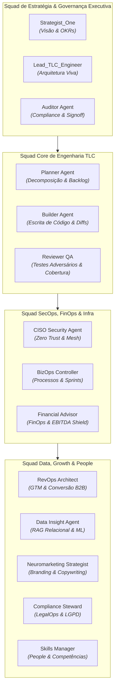
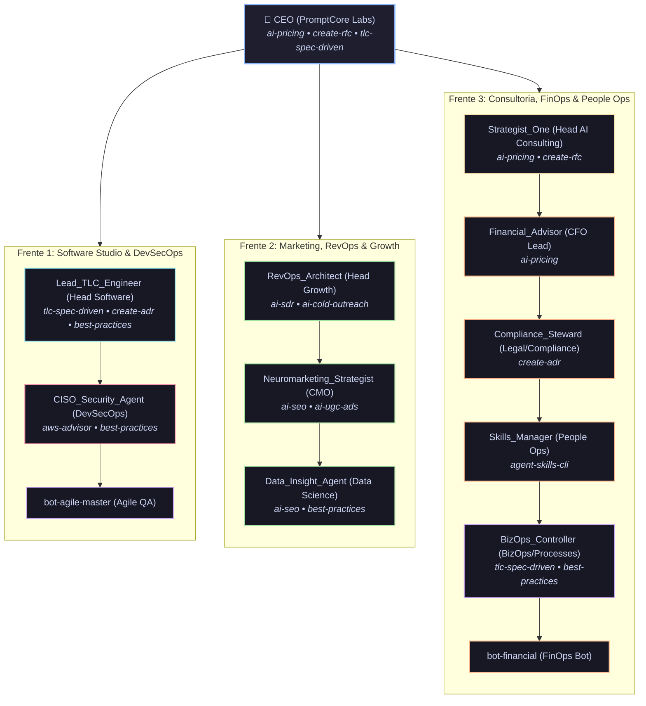

# Manual de Especificação dos 15 Agentes e Squads do PCL AEOS

==================================================
1. VISÃO GERAL DA SQUAD DE AGENTES
==================================================

O **PromptCoreLabs_AEOS** opera sob uma arquitetura de múltiplos agentes autônomos e especializados (**Multi-Agent System - MAS**). Cada agente possui um contrato operacional estrito, limites de autonomia delimitados, entradas/saídas padronizadas e uma atribuição clara na matriz de responsabilidade da plataforma.

A orquestração visual dos agentes é gerida pelo **PaperClip Dashboard** (porta `:3100`), e a inteligência de visualização de arquitetura é conduzida pela persona **Cortex** através do motor **Archify Engine**.

---

## 2. MATRIZ DE RESPONSABILIDADE DOS 15 AGENTES

---

## 2.1. ESTRUTURA ORGANIZACIONAL NO PAPERCLIP (ORG CHART DA HOLDING)

---

## 2.2. MATRIZ DE DISTRIBUIÇÃO DE SKILLS (PAPERCLIP + TLC SKILLS)

| Agente / Papel | Liderança / Atuação nas Verticais | Skills Originais (Paperclip) | Novas TLC Skills Adicionadas |
|---|---|---|---|
| **CEO** | Orquestração Geral PCL, Venture Studio | `brainstorm-okrs`, `north-star-metric`, `product-vision`, `outcome-roadmap`, `summarize-meeting` | `ai-pricing`, `create-rfc`, `tlc-spec-driven` |
| **Strategist_One** | Head de AI Consulting, GovTech & Estratégia | `brainstorm-okrs`, `north-star-metric`, `product-vision`, `outcome-roadmap`, `swot-analysis`, `lean-canvas`, `competitor-analysis`, `business-model`, `competitive-battlecard` | `ai-pricing`, `create-rfc` |
| **RevOps_Architect** | Head de RevOps, CRM, Automação & Vendas B2B | `ideal-customer-profile`, `gtm-strategy`, `gtm-motions`, `cohort-analysis`, `growth-loops`, `user-segmentation`, `customer-journey-map` | `ai-sdr`, `ai-cold-outreach` |
| **Neuromarketing_Strategist** | Head de Marketing Digital, Branding & Mídia | `marketing-ideas`, `positioning-ideas`, `product-name`, `value-prop-statements`, `customer-journey-map`, `user-personas` | `ai-seo`, `ai-ugc-ads` |
| **Data_Insight_Agent** | Lead de Data & Analytics, BI e Customer Success | `ab-test-analysis`, `metrics-dashboard`, `cohort-analysis`, `growth-loops`, `user-segmentation`, `product-vision` | `ai-seo`, `best-practices` |
| **Lead_TLC_Engineer** | Head de Software Studio & Vibe-Coding | `user-stories`, `create-prd`, `sprint-plan`, `test-scenarios`, `prioritize-features`, `outcome-roadmap` | `tlc-spec-driven`, `create-adr`, `best-practices`, `perf-astro` |
| **BizOps_Controller** | Lead de Operações, Qualidade e Processos | `sprint-plan`, `prioritization-frameworks`, `prioritize-features`, `release-notes`, `summarize-meeting`, `retro` | `tlc-spec-driven`, `best-practices` |
| **CISO_Security_Agent** | Head de DevSecOps, CyberSecurity & Cloud | `pre-mortem`, `privacy-policy`, `test-scenarios` | `aws-advisor`, `best-practices` |
| **Financial_Advisor** | Head de Financeiro, FinOps, Pricing & E-Commerce | `pricing-strategy`, `monetization-strategy`, `market-sizing`, `summarize-interview`, `draft-nda` | `ai-pricing` |
| **Compliance_Steward** | Lead de Jurídico, LGPD & Compliance | `draft-nda`, `privacy-policy` | `create-adr` |
| **Skills_Manager** | Lead de RH, People Ops & AI Academy | `review-resume`, `interview-script`, `summarize-interview`, `grammar-check` | `agent-skills-cli` |

---

## 3. ESPECIFICAÇÃO DETALHADA DOS 15 AGENTES

### 🛠️ Squad Core de Engenharia (Spec-Driven Loop)

#### 1. **Planner Agent** (`planner.md`)
- **Propósito**: Decomposição de especificações aprovadas (`specify.md` e `design.md`) em planos de tarefas atômicos e ordenados em `tasks.md`.
- **Limites de Autonomia**: Não escreve código de produção; não modifica o arquivo `specify.md` sem autorização.
- **Entradas**: `specify.md`, `design.md`, `FOUNDATION.md`.
- **Saídas**: `tasks.md`, checklist de validação por tarefas.

#### 2. **Builder Agent** (`builder.md`)
- **Propósito**: Escrita cirúrgica de código-fonte, criação de arquivos e refatoração respeitando estritamente o backlog do `tasks.md`.
- **Limites de Autonomia**: Não altera dependências globais sem consultar o Planner; não remove testes sem autorização do QA.
- **Entradas**: `tasks.md`, arquivos existentes no workspace.
- **Saídas**: Código modificado, novos arquivos, diffs em markdown.

#### 3. **Reviewer QA** (`reviewer-qa.md`)
- **Propósito**: Testes adversários, execução de testes unitários/integrados, auditoria de cobertura de código e verificação de regressão.
- **Limites de Autonomia**: Não aprova código com testes falhando; não aceita mocks genéricos para mascarar erros.
- **Entradas**: Código gerado pelo Builder, suíte de testes.
- **Saídas**: `validate.md`, relatórios de erros, aprovação do gate de testes.

#### 4. **Auditor Agent** (`auditor.md`)
- **Propósito**: Validação de compliance constitucional com a `Foundation` e selamento dos Stage Gates de governança.
- **Limites de Autonomia**: Não altera regras constitucionais; possui poder de veto no Stage Gate 5.
- **Entradas**: `validate.md`, `FOUNDATION.md`, logs de execução.
- **Saídas**: Assinatura final do gate e selamento em `STATE.md`.

---

### 🏛️ Squad Executiva & Departamental

#### 5. **Strategist_One** (`strategist-one.md`)
- **Liderança**: Departamento de Estratégia & Visão Corporativa.
- **Propósito**: Definição da North Star Metric, desdobramento de OKRs estratégicos e alinhamento do portfólio de produtos.

#### 6. **Lead TLC Engineer** (`lead-tlc-engineer.md`)
- **Liderança**: Departamento de Engenharia de Sistemas & Arquitetura.
- **Propósito**: Garantia da integridade arquitetural do PCL AEOS, padronização da metodologia TLC v3 e resolução de débitos técnicos.

#### 7. **CISO Security Agent** (`ciso-security-agent.md`)
- **Liderança**: Departamento de Segurança & Infraestrutura Zero Trust.
- **Propósito**: Sanitização de chaves de API, varredura adversária contra vazamento de segredos e imunização da rede mesh.

#### 8. **BizOps Controller** (`bizops-controller.md`)
- **Liderança**: Departamento de BizOps & Processos Ágeis.
- **Propósito**: Monitoramento do fluxo de entrega, cadência de sprints dos agentes e eliminação de gargalos no pipeline.

#### 9. **RevOps Architect** (`revops-architect.md`)
- **Liderança**: Departamento de Growth & Funil GTM.
- **Propósito**: Arquitetura do funil de conversão, integração de rotas de aquisição e métricas de retenção de usuários.

#### 10. **Financial Advisor** (`financial-advisor.md`)
- **Liderança**: Departamento de FinOps & Back Office.
- **Propósito**: Controle do EBITDA Shield, precificação de inferências de IA, contagem de tokens e DRE real-time.

#### 11. **Neuromarketing Strategist** (`neuromarketing-strategist.md`)
- **Liderança**: Departamento de Branding & Percepção de Valor.
- **Propósito**: Design de experiência visual, gatilhos de engajamento, Sexy Canvas e linguagem de alta percepção de valor.

#### 12. **Data Insight Agent** (`data-insight-agent.md`)
- **Liderança**: Departamento de Data Science & RAG.
- **Propósito**: Análise de embeddings vetoriais no PostgreSQL (`pcl-db`), otimização de busca vetorial e modelos preditivos.

#### 13. **Compliance Steward** (`compliance-steward.md`)
- **Liderança**: Departamento LegalOps & Compliance Regulatório.
- **Propósito**: Proteção de Propriedade Intelectual (PI), alinhamento com a LGPD e governança contratual.

#### 14. **Skills Manager** (`skills-manager.md`)
- **Liderança**: Departamento de People Ops & Gestão de Conhecimento.
- **Propósito**: Curadoria do repositório de skills dos agentes, onboarding de novos integrantes e handoff de sessão.

#### 15. **Persona Cortex** (Inteligência & Arquitetura Viva)
- **Liderança**: Núcleo de Visualização & Archify Engine.
- **Propósito**: Ingestão de metadados do repositório, validação de limites de layout, compilação de diagramas interativos HTML e manutenção do Portal Mestre.

---

## 4. INTEGRAÇÃO COM OS DIAGRAMAS INTERATIVOS
Esta especificação detalhada conecta-se diretamente aos diagramas do Portal Mestre:
- 🔵 **[agents-squad-map.html](file:///c:/PromptCore_Labs/projects/Living%20Architecture%20PCL%20AEOS/diagrams/interactive/agents-squad-map.html)**: Visualização da orquestração de papéis.
- 🟢 **[seq-tlc-execution.html](file:///c:/PromptCore_Labs/projects/Living%20Architecture%20PCL%20AEOS/diagrams/interactive/seq-tlc-execution.html)**: Sequência de execução entre Planner, Builder, QA e Auditor.
