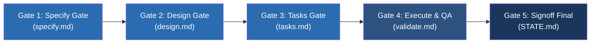

# Artigo Técnico: Governança TLC Spec-Driven v3 & 5 Stage Gates — PCL AEOS

==================================================
1. PRINCÍPIOS DA GOVERNANÇA SPEC-DRIVEN
==================================================

A governança do **PCL AEOS** garante que nenhuma linha de código de produção seja escrita sem especificações prévias aprovadas e validadas por testes adversários de QA e verificações de segurança do CISO.

---

## 2. MATRIZ DOS 5 STAGE GATES SEQUENCIAIS

### Detalhamento dos Gates:
1. **Gate 1 — Specify Gate (`specify.md`)**: Definição do escopo, problemas, Requisitos Funcionais (FR-001+) e Requisitos Não Funcionais (NFR-001+). Autoridade: *Planner Agent / Strategist_One*.
2. **Gate 2 — Design Gate (`design.md`)**: Arquitetura de software, diagramação C4 Model e Matriz de Rastreabilidade. Autoridade: *Lead TLC Engineer / Cortex*.
3. **Gate 3 — Tasks Gate (`tasks.md`)**: Decomposição em tarefas atômicas executáveis (`TASK-001+`) com critérios claros de aceite. Autoridade: *Planner Agent*.
4. **Gate 4 — Execute & QA Gate (`validate.md`)**: Execução de código pelo Builder, suíte de testes adversários pelo Reviewer QA e varredura Zero Secret Leak pelo CISO. Autoridade: *Reviewer QA / CISO Agent*.
5. **Gate 5 — Signoff Final (`STATE.md`)**: Validação de compliance constitucional da Foundation e autorização de fechamento pelo Operador Humano. Autoridade: *Auditor Agent / Operador Humano*.

---

## 3. INTEGRAÇÃO COM OS DIAGRAMAS INTERATIVOS
- 🟢 **[seq-tlc-execution.html](file:///c:/PromptCore_Labs/projects/Living%20Architecture%20PCL%20AEOS/diagrams/interactive/seq-tlc-execution.html)**: Ciclo de validação Spec-Driven.
- 🔵 **[gov-stage-gates-matrix.html](file:///c:/PromptCore_Labs/projects/Living%20Architecture%20PCL%20AEOS/diagrams/interactive/gov-stage-gates-matrix.html)**: Matriz dos 5 Stage Gates sequenciais.
