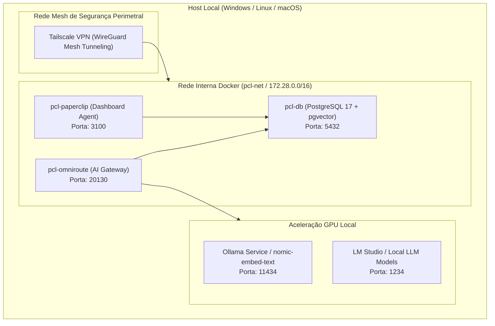

# Artigo Técnico: Infraestrutura & Docker Harness — PCL AEOS

==================================================
1. ARQUITETURA DA INFRAESTRUTURA FÍSICA E VIRTUAL
==================================================

A infraestrutura do **PromptCoreLabs_AEOS** é projetada sob o princípio de **Soberania Local (Local-First Architecture)**, onde todos os serviços essenciais de banco de dados, roteamento de inferência e orquestração de agentes funcionam em contêineres Docker locais isolados.

---

## 2. TOPOLOGIA DOS CONTÊINERES DOCKER (`docker-compose.yml`)

---

## 3. TABELA DE SERVIÇOS, PORTAS E RECURSOS DO HARNESS

| Nome do Serviço | Contêiner Docker | Porta Host | Função Arquitetural | Dependências |
|---|---|---|---|---|
| **pcl-db** | `pcl-db` | `5432` | Banco de Dados PostgreSQL 17 + PGVector para RAG e audit logs. | Nenhum (Volume `pcl-db-data`) |
| **pcl-omniroute** | `pcl-omniroute` | `20130` | AI Gateway, proxy de inferência, prompt caching e fallback LLM. | `pcl-db`, GPUs locais |
| **pcl-paperclip** | `pcl-paperclip` | `3100` | Dashboard web de orquestração visual dos 15 papéis de agentes. | `pcl-db` |
| **Ollama Local** | Processo Host | `11434` | Provedor local de embeddings (`nomic-embed-text`) e LLMs open-source. | GPU CUDA / ROCm |
| **LM Studio** | Processo Host | `1234` | Provedor local de inferência em formato OpenAI-compatible. | GPU CUDA / ROCm |
| **Tailscale VPN** | Processo Host | `41641/UDP` | Tunelamento criptografado WireGuard para acesso remoto seguro aos contêineres. | Modulo Kernel WireGuard |

---

## 4. INTEGRAÇÃO COM OS DIAGRAMAS INTERATIVOS
- 🟢 **[c4-l2-containers.html](file:///c:/PromptCore_Labs/projects/Living%20Architecture%20PCL%20AEOS/diagrams/interactive/c4-l2-containers.html)**: Topologia C4 Level 2 dos Contêineres Docker.
- 🟡 **[infra-network-security.html](file:///c:/PromptCore_Labs/projects/Living%20Architecture%20PCL%20AEOS/diagrams/interactive/infra-network-security.html)**: Rede de segurança perimetral WireGuard / Tailscale VPN Mesh.
