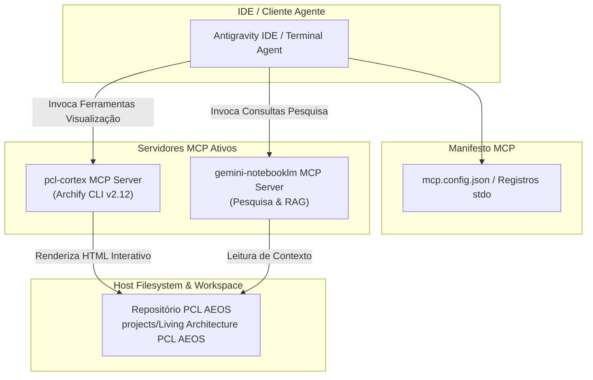

# Artigo Técnico: Integrações & Protocolo MCP (Model Context Protocol) — PCL AEOS

==================================================
1. VISÃO GERAL DO PROTOCOLO MCP NO PCL AEOS
==================================================

O **Model Context Protocol (MCP)** é o padrão de integração assíncrona baseado em JSON-RPC via stdio que conecta a IDE do desenvolvedor (Antigravity) aos servidores de ferramentas especializadas no host.

---

## 2. SERVIDORES MCP REGISTRADOS

1. **`pcl-cortex` MCP Server**: Servidor nativo do Cortex para validação, renderização e compilação da suíte visuais do motor Archify CLI (`archify.mjs`).
2. **`gemini-notebooklm` MCP Server**: Servidor de pesquisa, síntese de documentos e consulta a cadernos de conhecimento.

---

## 3. TOPOLOGIA DE CONEXÃO MCP

---

## 4. INTEGRAÇÃO COM OS DIAGRAMAS INTERATIVOS
- 🔵 **[mcp-interconnection.html](file:///c:/PromptCore_Labs/projects/Living%20Architecture%20PCL%20AEOS/diagrams/interactive/mcp-interconnection.html)**: Mapa de interconexão entre o cliente de IA, servidores MCP e o workspace.
