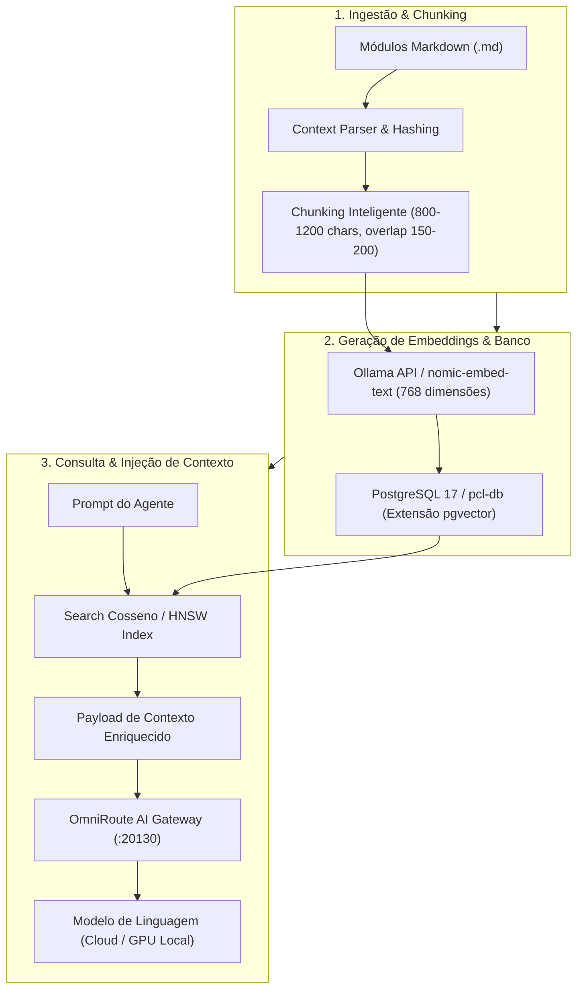
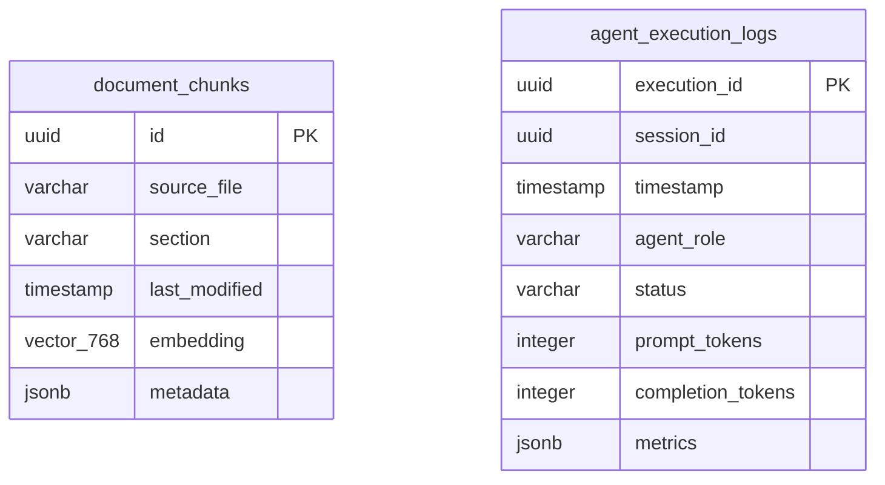

# Módulo RAG Vetorial & Memory Dataflow — PCL AEOS

==================================================
1. ARQUITETURA DA MEMÓRIA ORGANIZACIONAL
==================================================

O módulo **Memory** do **PromptCoreLabs_AEOS** é a camada responsável pela persistência computacional, indexação vetorial, gerenciamento de contexto e cache semântico de toda a plataforma.

Ao contrário do módulo `knowledge/` (que armazena documentação legível por humanos em markdown estático), o módulo `memory/` armazena e consulta índices vetoriais, embeddings e métricas legíveis por máquinas e interpretados por agentes de IA via **RAG (Retrieval-Augmented Generation)**.

---

## 2. PIPELINE DE RAG LOCAL & BUSCA VETORIAL



---

## 3. ESPECIFICAÇÃO DE CHUNKING & REGRAS DE INDEXAÇÃO

### Regras de Segmentação de Texto
- **Tamanho do Chunk**: 800 a 1200 caracteres (~200 a 300 tokens por fatia).
- **Sobreposição (Overlap)**: 150 a 200 caracteres para preservação de contexto contíguo.
- **Divisão Semântica**: Respeita a estrutura do documento utilizando delimitadores de linha (`===`) ou títulos Markdown (`#`, `##`, `###`).

### Estrutura de Payload e Metadados do Vetor (`JSONB`)
Cada vetor armazenado no `pcl-db` contém a seguinte estrutura de metadados obrigatórios:

```json
{
  "source_file": "foundation/FOUNDATION.md",
  "section": "1. PRINCÍPIOS FUNDAMENTAIS",
  "last_modified": "2026-07-30T21:40:00Z",
  "taxonomy": "AEOS",
  "layer": "Foundation",
  "sha_commit": "a1b2c3d4e5f67890",
  "tokens": 245
}
```

---

## 4. INFRAESTRUTURA DE BANCO VETORIAL (`pcl-db`)

A persistência vetorial roda dentro do contêiner Docker `pcl-db` (PostgreSQL 17 com extensão `pgvector` habilitada):

- **Porta do Banco**: `5432`
- **Banco de Dados**: `paperclip`
- **Tabela de Vetores**: `document_chunks`
- **Tabela de Logs e Telemetria**: `agent_execution_logs`
- **Algoritmo de Similaridade**: Distância por Cosseno (`<=>`)
- **Aceleração de Índice**: Índice HNSW (`m=16`, `ef_construction=64`)

### Tabela Relacional E-R (`document_chunks` & `agent_execution_logs`)



---

## 5. INTEGRAÇÃO COM OS DIAGRAMAS INTERATIVOS
Este módulo refere-se diretamente aos diagramas do Portal Mestre:
- 🟡 **[data-rag-memory.html](file:///c:/PromptCore_Labs/projects/Living%20Architecture%20PCL%20AEOS/diagrams/interactive/data-rag-memory.html)**: Lineage do pipeline de ingestão e busca vetorial RAG.
- 💜 **[obs-audit-trail.html](file:///c:/PromptCore_Labs/projects/Living%20Architecture%20PCL%20AEOS/diagrams/interactive/obs-audit-trail.html)**: Coleta de logs de execução e métricas de tokens no `pcl-db`.
