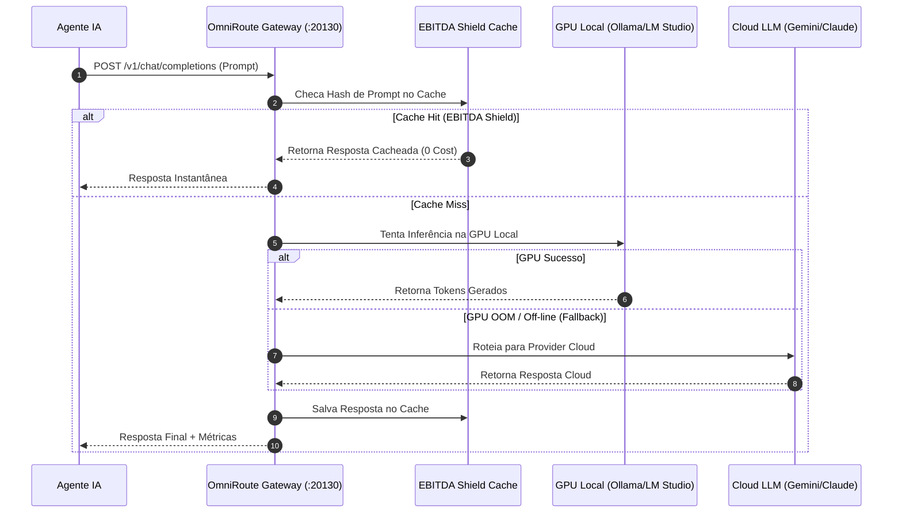

# Artigo Técnico: Runtime & AI Gateway OmniRoute — PCL AEOS

==================================================
1. VISÃO GERAL DO RUNTIME DE INFERÊNCIA E ORQUESTRAÇÃO
==================================================

O Runtime do **PCL AEOS** é a camada responsável pela execução das chamadas de inferência de IA, roteamento dinâmico de prompts, prompt caching e exibição do painel de orquestração de agentes.

---

## 2. COMPONENTES CHAVE DO RUNTIME

### 1. **OmniRoute AI Gateway** (Porta `:20130`)
- **EBITDA Shield**: Cache semântico de prompts para evitar re-computação de contextos idênticos e economizar custos de tokens.
- **Fallback Dinâmico**: Roteamento transparente. Se uma GPU local falhar ou estourar a memória (OOM), o OmniRoute direciona a requisição para provedores de nuvem (Gemini / Claude / OpenAI) sem quebrar a sessão do agente.
- **Token Budgeting**: Limite de tokens por agente e sessão com logs de telemetria enviados ao `pcl-db`.

### 2. **PaperClip Dashboard** (Porta `:3100`)
- Painel web de orquestração em tempo real dos 15 papéis de agentes.
- Visualização de estados dos agentes, logs de execução por Execution Cell e triggers de tarefas.

---

## 3. CICLO DE VIDA DA REQUISIÇÃO DE INFERÊNCIA

---

## 4. INTEGRAÇÃO COM OS DIAGRAMAS INTERATIVOS
- 🟡 **[seq-omniroute-routing.html](file:///c:/PromptCore_Labs/projects/Living%20Architecture%20PCL%20AEOS/diagrams/interactive/seq-omniroute-routing.html)**: Ciclo de vida da requisição no OmniRoute.
- 🟡 **[life-cortex-micro-loop.html](file:///c:/PromptCore_Labs/projects/Living%20Architecture%20PCL%20AEOS/diagrams/interactive/life-cortex-micro-loop.html)**: Ciclo de vida do micro-loop de execução dos agentes.
