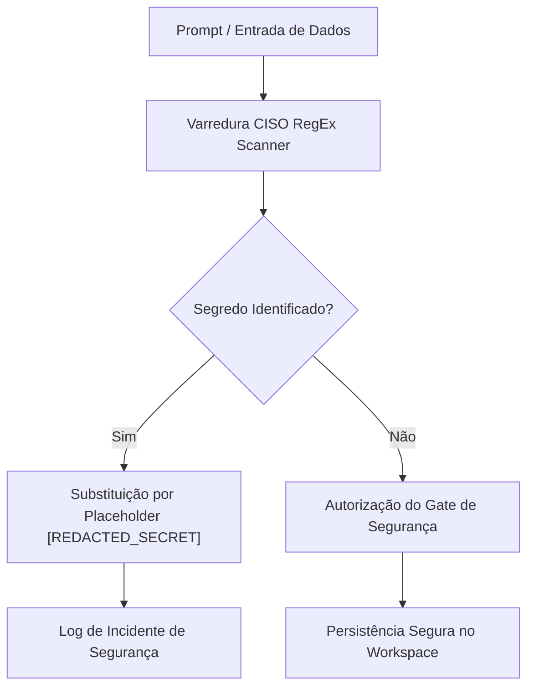

# Artigo Técnico: Segurança & Compliance Zero Trust — PCL AEOS

==================================================
1. DIRETRIZES DE SEGURANÇA ZERO TRUST
==================================================

A postura de segurança do **PCL AEOS** é pautada no modelo **Zero Trust (Confiança Zero)**. Nenhum componente interno, contêiner ou requisição é considerado seguro por padrão sem verificação contínua.

---

## 2. PILARES DA SEGURANÇA NO AEOS

1. **Zero Secret Leak**: Garantia absoluta de que nenhuma chave de API, senha de banco de dados, token JWT ou segredo `.env` seja exposto nos logs, artefatos markdown ou diagramas.
2. **Varredura Adversária CISO**: O agente **CISO Security Agent** executa varreduras com expressões regulares sobre cada commit e output de agente antes da aprovação do Stage Gate 4.
3. **Isolamento de Contêineres**: A rede Docker Bridge (`pcl-net`) proíbe a exposição de portas administrativas para a internet pública, restringindo acesso via WireGuard / Tailscale VPN Mesh.

---

## 3. FLUXO DE SANITIZAÇÃO DE SEGREDOS

---

## 4. INTEGRAÇÃO COM OS DIAGRAMAS INTERATIVOS
- 💜 **[sec-zero-trust-flow.html](file:///c:/PromptCore_Labs/projects/Living%20Architecture%20PCL%20AEOS/diagrams/interactive/sec-zero-trust-flow.html)**: Fluxo de gerenciamento de segredos e imunização Zero Trust.
