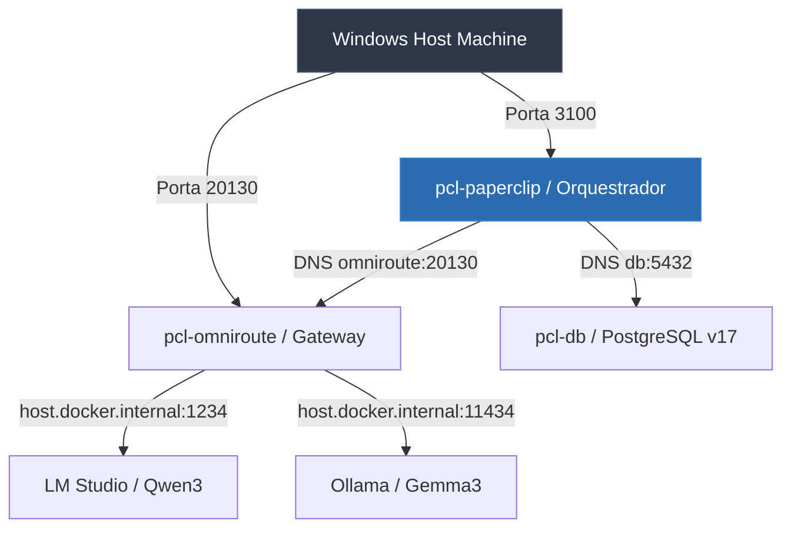

==================================================
OBJETIVO
==================================================

O módulo Runtime do PromptCoreLabs_AEOS é responsável pela execução operacional da plataforma. Ele abriga o Harness Engineering (infraestrutura local de execução), os modelos de dados e a orquestração ativa dos agentes.

O Runtime materializa os fluxos de trabalho definidos pelo Knowledge e pela Governance, atuando como o motor de execução do ecossistema.

==================================================
POSIÇÃO ARQUITETURAL
==================================================

O módulo Runtime é alimentado por todas as camadas superiores da arquitetura:

Foundation
↓
Governance
↓
Bootstrap
↓
Knowledge / Memory
↓
Agents
↓
Runtime

O Runtime executa processos. Ele não possui autoridade para definir regras, princípios arquiteturais ou conhecimentos permanentes.

==================================================
ESTRUTURA DO MÓDULO
==================================================

runtime/
├── README.md                        ← este documento
│
├── harness/
│   ├── README.md                    ← introdução ao Harness local
│   ├── overview.md                  ← visão dos containers e rede
│   └── docker-compose.md            ← guia operacional do docker-compose
│
├── models/
│   ├── README.md                    ← introdução à camada de modelos
│   ├── routing.md                   ← lógica do OmniRoute e tiers de IA
│   └── local-models.md              ← configuração do LM Studio e Ollama
│
└── orchestration/
    ├── README.md                    ← introdução à orquestração
    └── paperclip.md                 ← orquestração com PaperClip Swarms

==================================================
DIRETRIZ DE EXECUÇÃO
==================================================

Todo processo executado pelo Runtime deve ser auditável e registrar logs operacionais adequados. Nenhuma execução deve violar as restrições de segurança de dados contidas nas políticas da Governance.

==================================================
DIAGRAMA DE TOPOLOGIA: SERVIÇOS DO RUNTIME
==================================================

Os três contêineres e suas pontes de conexão locais:



==================================================
GUIA QUICKSTART: COMANDOS DO RUNTIME (DOCKER)
==================================================

### Passo 1 — Subir a infraestrutura
A partir da raiz do repositório, inicie todos os contêineres mapeados no Docker Compose:
```bash
docker compose up -d
```

### Passo 2 — Diagnóstico rápido de serviços
Verifique se os contêineres estão rodando de forma saudável:
```bash
docker compose ps
```

### Passo 3 — Verificar conexão de rede
Veja se o gateway de IA está respondendo a requisições locais:
```bash
curl http://localhost:20130/health
```

==================================================
FONTES DE VERDADE
==================================================

foundation/FOUNDATION.md

architecture/modules.md

architecture/principles.md

