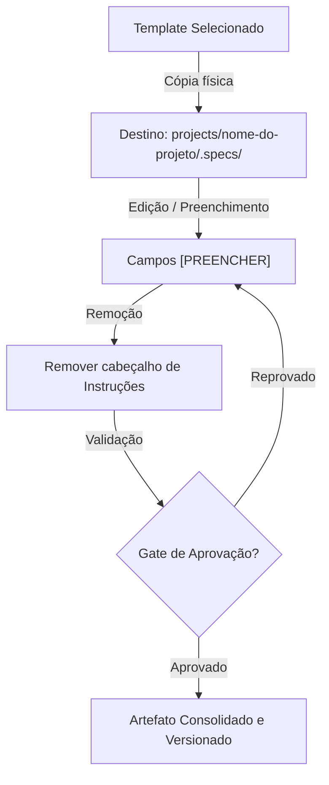

==================================================
OBJETIVO
==================================================

O módulo Templates do PromptCoreLabs_AEOS centraliza os artefatos de documento reutilizáveis e padronizados para toda a plataforma.

Templates são documentos em branco pré-estruturados que eliminam o trabalho de criação de scaffolding e garantem consistência entre iniciativas, projetos e agentes.

==================================================
POSIÇÃO ARQUITETURAL
==================================================

O módulo Templates é uma camada de suporte horizontal que atende tanto ao fluxo de Governance (ADRs, decisões) quanto à metodologia TLC (especificações, designs, tasks, validações):

Foundation
↓
Governance ←──── Templates (consulta e instancia)
↓
Bootstrap  ←──── Templates (instancia ao criar novos projetos)
↓
Knowledge / Memory
↓
Agents     ←──── Templates (usa ao produzir artefatos)

==================================================
ESTRUTURA DO MÓDULO
==================================================

templates/
├── README.md                        ← este documento
│
├── tlc/
│   ├── README.md                    ← visão dos templates da metodologia TLC
│   ├── specify-template.md          ← template em branco de specify.md
│   ├── design-template.md           ← template em branco de design.md
│   ├── tasks-template.md            ← template em branco de tasks.md
│   └── validate-template.md         ← template em branco de validate.md
│
└── governance/
    ├── README.md                    ← visão dos templates de governança
    └── adr-template.md              ← template em branco de ADR

==================================================
COMO USAR OS TEMPLATES
==================================================

Passo 1 — Copie o template para a pasta de especificações do seu projeto:

  projects/[nome-do-projeto]/.specs/[nome-do-artefato].md

Passo 2 — Preencha os campos marcados entre colchetes [ ].

Passo 3 — Remova as instruções de uso do próprio template ao finalizar.

Passo 4 — Solicite a aprovação do gate correspondente antes de avançar de etapa.

==================================================
DIAGRAMA DE FLUXO: CICLO DE VIDA DO TEMPLATE
==================================================

O fluxo de instanciação de artefatos de engenharia segue o ciclo:



==================================================
GUIA QUICKSTART: COMANDOS DE INSTANCIAÇÃO
==================================================

### Exemplo 1 — Inicializar Especificação (Specify) para o Projeto "Alpha"
Para criar o arquivo inicial de especificações funcionais de um novo projeto:
```bash
# Crie o diretório de especificações do projeto
mkdir -p projects/Alpha/.specs

# Copie o template
cp templates/tlc/specify-template.md projects/Alpha/.specs/specify.md
```

### Exemplo 2 — Inicializar Novo ADR de Decisão Técnica
Para propor uma nova decisão de arquitetura na governança:
```bash
# Copie o template renomeando com ID de 4 dígitos
cp templates/governance/adr-template.md architecture/decisions/ADR-0005-nova-decisao.md
```

==================================================
REGRA DE IMUTABILIDADE
==================================================

Os templates originais neste módulo nunca devem ser editados ou preenchidos diretamente.

Sempre copie o template para o diretório de destino antes de preencher.

==================================================
FONTES DE REFERÊNCIA
==================================================

knowledge/patterns/tlc-spec-driven.md

knowledge/patterns/adr-pattern.md

governance/stage-gates.md

